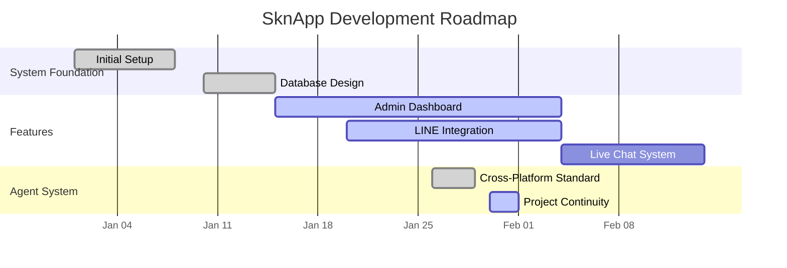

# Project Status: SknApp

> **Last Updated:** 2026-01-31 10:35 by Antigravity

## 🇹🇭 สรุปสถานะโครงการ (Thai Summary)
Ralph Loop เสร็จสมบูรณ์! สำเร็จ 3 features: (1) **Project Continuity System** ✓ - สร้าง unified agent handoff/pickup skills เสร็จแล้ว, (2) **Rich Menu Persistence** ✓ - เพิ่ม sync tracking ใน database เสร็จแล้ว, (3) **Chat UI Refinement** ✓ - เพิ่ม message ACK/retry UI เสร็จแล้ว
**งานที่เสร็จแล้ว:** ทั้ง 3 phases เสร็จสมบูรณ์ (Project Continuity, Rich Menu Persistence, Chat UI)
**ขั้นตอนถัดไป:** รอ database migration upgrade (ต้อง run PostgreSQL)

## 🛠️ Technical Environment (Critical)
- **OS**: Windows (WSL2 required for all development)
- **Backend**: `backend/venv_linux` (Must run in WSL, use `uv` for dependencies)
- **Frontend**: Run in WSL (`npm run dev`)
- **Database**: PostgreSQL (Running in WSL)

## 🗺️ Project Roadmap

## 🚀 Active Milestones

### 🧠 Agent Collaboration System (Status: ✅ COMPLETE)
- [x] Cross-platform handoff standards (file: `.agent/skills/cross_platform_collaboration/SKILL.md`)
- [x] **Project Continuity System** - COMPLETE ✓
    - [x] Design Project Status Standard
    - [x] Create `PROJECT_STATUS.md`
    - [x] **Unified Handoff/Pickup Skills**
        - [x] Create `/agent_handoff` skill ✓
        - [x] Create `/agent_pickup` skill ✓
        - [x] Update workflow references ✓

### 💬 Live Chat & LINE Integration (Status: ✅ COMPLETE)
- [x] Basic Webhook
- [x] Rich Menu CRUD endpoints
- [x] **Rich Menu Persistence** - COMPLETE ✓ (Link: `.claude/PRPs/plans/project-continuity-rich-menu-chat-ui.plan.md`)
    - [x] Add sync_status tracking to database
    - [x] Implement idempotent sync
    - [x] Add sync-status endpoint
- [x] **Chat UI Refinement** - CORE COMPLETE ✓ (Link: `.claude/PRPs/plans/project-continuity-rich-menu-chat-ui.plan.md`)
    - [x] Add message ACK types
    - [x] Add status indicators
    - [x] Implement retry logic
    - [ ] Task 14: Offline mode enhancements (optional)
    - [ ] Task 15: Unit tests (optional)

## 📋 Backlog (Future)
- [ ] Automated Testing Pipeline
- [ ] Production Deployment Setup
- [ ] User Documentation

## ✅ Recent Completions
- [2026-01-31] Installed **Context7 MCP Server** for real-time documentation (Antigravity)
- [2026-01-30] Ralph Loop COMPLETE: All 3 phases (Project Continuity, Rich Menu Persistence, Chat UI) implemented (Claude Code)
- [2026-01-30] Phase 2 Complete: Rich menu sync persistence with idempotent operations (Claude Code)
- [2026-01-30] Phase 3 Complete: Chat UI with message ACK/retry status indicators (Claude Code)
- [2026-01-30] Phase 1 Complete: Created `/agent_handoff` and `/agent_pickup` unified skills (Claude Code)
- [2026-01-30] Created implementation plan for Project Continuity, Rich Menu, and Chat UI (Claude Code)
- [2026-01-30] Initiated Project Continuity System (Antigravity)
- [2026-01-29] Restructured Project Logs (Claude Code)
- [2026-01-28] Implemented Cross-Platform Handoff (Antigravity)
