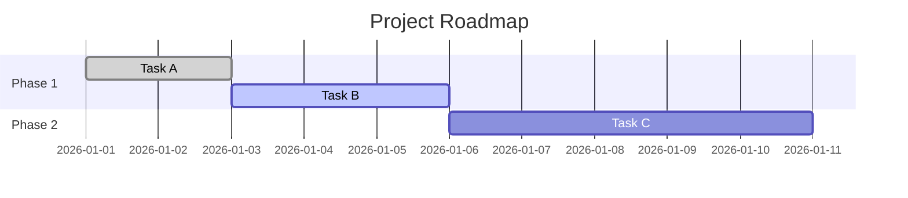

# Project Status Standard

## Mandatory State Consistency Rule

`PROJECT_STATUS.md` cannot be updated alone. Every status update session must also reconcile:
- `.agent/state/current-session.json`
- `.agent/state/task.md`

If these files are not aligned, the status update is incomplete and must be treated as invalid handoff metadata.

## Overview

The `PROJECT_STATUS.md` file located at `.agent/PROJECT_STATUS.md` is the **Central Dashboard** of the project. It provides a high-level overview of "What is happening now" and "Where are we going".

**Goal:** Any AI agent (Antigravity, Claude, Gemini, etc.) should be able to read this single file and immediately understand:
1. The Grand Plan (Roadmap)
2. The Current Focus (Active Milestone)
3. What was just finished (Context)

## Core Rules

1.  **Single Source of Truth**: This file supersedes individual session logs for high-level status.
2.  **Always Up-to-Date**: Agents MUST update this file:
    *   **Start of Session**: Read it to understand context.
    *   **End of Task**: Update "Recent Completions" and "Active Milestones".
    *   **Handover**: Ensure it matches the handover report.
3.  **Bilingual Summary**: The top section MUST include a Thai summary for the user.
4.  **Visual Roadmap**: Use Mermaid diagrams to visualize phases.
5.  **Task Linking**: Link active items to their specific `task.md` or `issue` ID.

## File Structure

### 1. Header & Thai Summary
Must appear at the top.

```markdown
# Project Status: [Project Name]

> **Last Updated:** [YYYY-MM-DD HH:MM] by [Agent Name]

## 🇹🇭 สรุปสถานะโครงการ (Thai Summary)
[Short paragraph in Thai interpreting the current status for the user]
Current Focus: [Brief Thai description]
Next Step: [Brief Thai description]
```

### 2. Visual Roadmap (Mermaid)
A Gantt or Flowchart showing major phases.



### 3. Active Milestones & Tasks
Breakdown of what is currently in progress.

```markdown
## 🚀 Active Milestones (Phase: [Phase Name])

### [Milestone Name] (Status: In Progress)
- [x] Completed Item
- [/] **Current Item** (Link: `.agent/state/task.md`) <!-- Critical link -->
- [ ] Pending Item
```

### 4. Backlog & Future
High-level list of what's next.

```markdown
## 📋 Backlog
- [ ] Future Feature A
- [ ] Future Feature B
```

### 5. Recent Completions
History of what was recently done (Keep last 5-10 items).

```markdown
## ✅ Recent Completions
- [2026-01-30] Completed Login Flow (Agent: Antigravity)
- [2026-01-29] Fixed Database Schema (Agent: Claude Code)
```

## Maintenance Usage

### When to Update
- **Starting a new big feature**: Add to Active Milestones.
- **Finishing a feature**: Move to Recent Completions, check off in Roadmap.
- **Blocking Issues**: Add a "🛑 BLOCKED" note in Active Milestones.

### How to Update (Conflict Resolution)
1.  **Timestamp Validation**: Check the `Last Updated` timestamp in the file.
    *   **Current > File**: Update the header timestamp to your current time.
    *   **File > Current**: Do **NOT** update the header timestamp. Keep the newer one.
2.  **Merge Strategy (Recent Completions)**:
    *   **ALWAYS** add your new items to "Recent Completions", regardless of the timestamp.
    *   **Deduplicate**: Check if your item is already listed.
    *   **Sort**: Insert your item chronologically if possible, otherwise add to top.
    *   **Preserve History**: Keep at least the last 15 items. Do not delete other agents' work.
3.  **Visuals**: Verifiy Mermaid syntax.
4.  **Format**: Be concise and use emojis.
