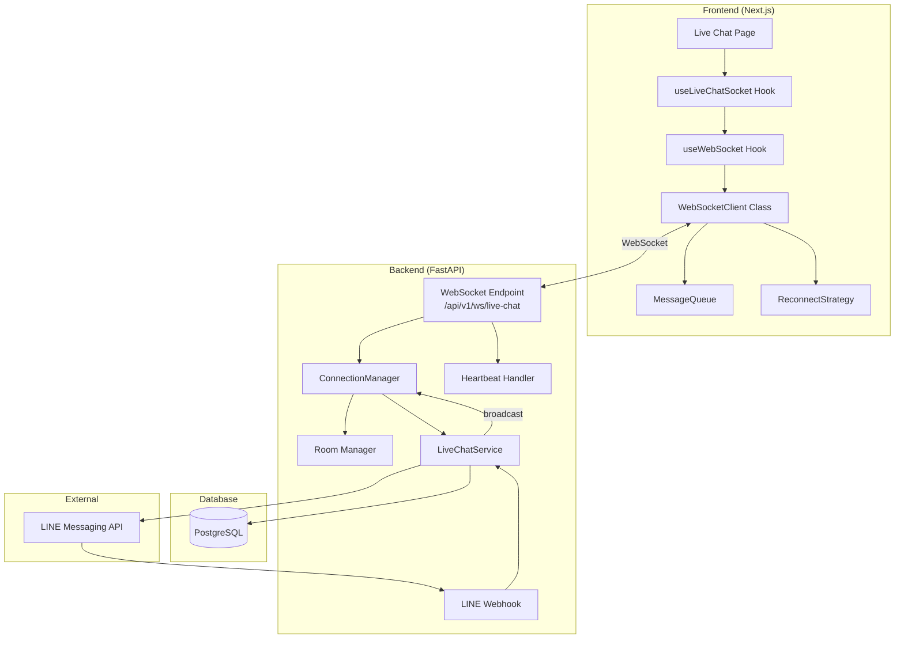
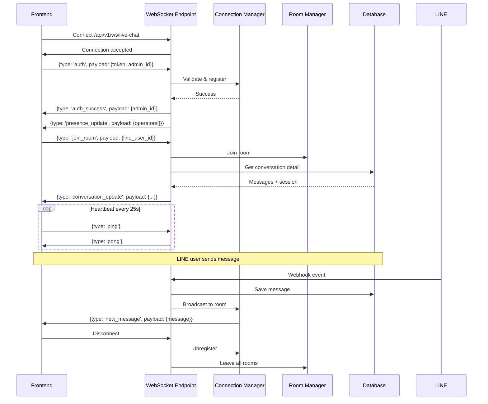
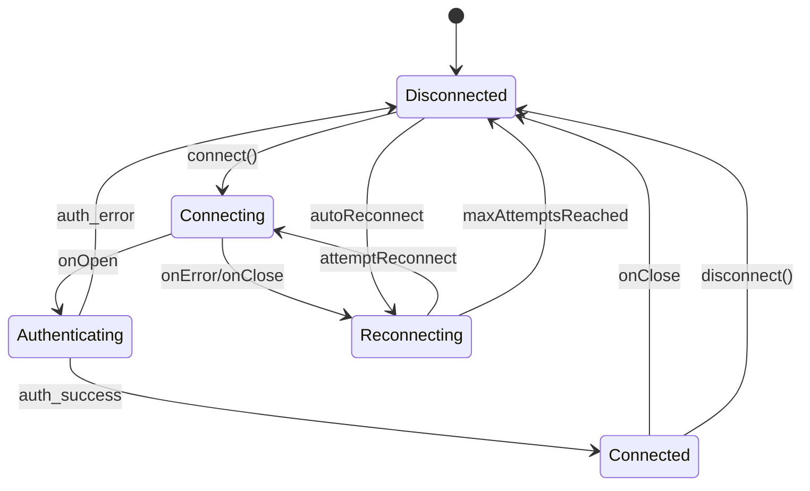

# Feature: WebSocket Architecture for Live Chat

## Summary

Transform the live chat system from HTTP polling (5s conversations, 3s messages) to real-time WebSocket communication. This enables instant message delivery, typing indicators, presence awareness, and significantly reduces server load while improving operator experience for handling multiple conversations.

## User Story

As an **admin/operator**
I want to **receive and send messages in real-time without page refreshes**
So that **I can respond faster to customers, see typing indicators, and handle multiple conversations efficiently**

## Problem Statement

The current polling-based architecture creates:
1. **3-5 second latency** - Messages appear delayed, hurting customer experience
2. **High server load** - Constant polling even when idle (~720 requests/hour per operator)
3. **No typing indicators** - Operators can't see when customers are typing
4. **No presence awareness** - Can't tell if operators are online/away
5. **Inefficient bandwidth** - Full data fetched even with no changes
6. **Poor multi-operator coordination** - No real-time updates when another operator claims a session

## Solution Statement

Implement a WebSocket-based real-time communication layer with:
- **Connection Manager** with room-based architecture (per conversation)
- **Event-driven messaging** for instant delivery
- **Typing indicators** and **presence tracking**
- **Offline message queue** for reliability
- **Graceful fallback** to polling if WebSocket fails
- **Explicit auth handshake** before operations
- Keep existing REST endpoints for non-real-time operations

## Metadata

| Field            | Value                                             |
| ---------------- | ------------------------------------------------- |
| Type             | ENHANCEMENT                                       |
| Complexity       | HIGH                                              |
| Systems Affected | backend/api, backend/services, frontend/live-chat |
| Dependencies     | FastAPI WebSocket (built-in), Native WebSocket API |
| Estimated Tasks  | 14                                                |

---

## Architecture Diagram



## Connection Flow



## Frontend State Machine



## Room/Channel Structure

```
rooms/
├── conversation:{line_user_id}  # Room per conversation (operators viewing same chat)
├── admin:{admin_id}             # Private room per admin (for direct notifications)
└── broadcast                    # Global broadcasts (presence updates)
```

---

## UX Design

### Before State
```
╔═══════════════════════════════════════════════════════════════════════════════╗
║                              CURRENT POLLING ARCHITECTURE                      ║
╠═══════════════════════════════════════════════════════════════════════════════╣
║                                                                               ║
║   ┌─────────────┐    every 5s    ┌─────────────┐         ┌─────────────┐     ║
║   │  Frontend   │ ─────────────► │  REST API   │ ──────► │  Database   │     ║
║   │  Live Chat  │ ◄───────────── │  /convos    │ ◄────── │  (Query)    │     ║
║   └─────────────┘  full data     └─────────────┘         └─────────────┘     ║
║         │                                                                     ║
║         │ every 3s (per selected chat)                                        ║
║         ▼                                                                     ║
║   ┌─────────────┐    GET         ┌─────────────┐         ┌─────────────┐     ║
║   │  Messages   │ ─────────────► │  /convos/id │ ──────► │  50 msgs    │     ║
║   │  Component  │ ◄───────────── │  (full)     │ ◄────── │  (always)   │     ║
║   └─────────────┘                └─────────────┘         └─────────────┘     ║
║                                                                               ║
║   PAIN_POINTS:                                                                ║
║   - 3-5 second latency on new messages                                        ║
║   - No typing indicators                                                      ║
║   - ~720 API calls/hour per idle operator                                     ║
║   - Full data transfer even when nothing changed                              ║
║   - No presence awareness                                                     ║
║   - Race conditions when multiple operators work                              ║
║                                                                               ║
╚═══════════════════════════════════════════════════════════════════════════════╝
```

### After State
```
╔═══════════════════════════════════════════════════════════════════════════════╗
║                              WEBSOCKET ARCHITECTURE                            ║
╠═══════════════════════════════════════════════════════════════════════════════╣
║                                                                               ║
║   ┌─────────────┐    WS connect   ┌─────────────────────────────────────┐     ║
║   │  Frontend   │ ═══════════════►│       WebSocket Manager             │     ║
║   │  Live Chat  │                 │  ┌─────────────────────────────┐   │     ║
║   └─────────────┘                 │  │ Connection Pool              │   │     ║
║         ║                         │  │  - operator_1 → [ws1, ws2]   │   │     ║
║         ║ bidirectional           │  │  - conversation:U123 → [ws1] │   │     ║
║         ║ events                  │  └─────────────────────────────┘   │     ║
║         ║                         └─────────────────────────────────────┘     ║
║         ║                                       │                             ║
║         ▼                                       ▼                             ║
║   ┌─────────────────────────────────────────────────────────────────────┐     ║
║   │                         EVENT TYPES                                  │     ║
║   │                                                                      │     ║
║   │  CLIENT → SERVER:                SERVER → CLIENT:                    │     ║
║   │  ├─ auth                         ├─ auth_success / auth_error       │     ║
║   │  ├─ join_room                    ├─ new_message                     │     ║
║   │  ├─ leave_room                   ├─ message_sent                    │     ║
║   │  ├─ send_message                 ├─ typing_indicator                │     ║
║   │  ├─ typing_start / typing_stop   ├─ session_claimed                 │     ║
║   │  ├─ claim_session                ├─ session_closed                  │     ║
║   │  ├─ close_session                ├─ presence_update                 │     ║
║   │  └─ ping                         ├─ conversation_update             │     ║
║   │                                  ├─ error                           │     ║
║   │                                  └─ pong                            │     ║
║   └─────────────────────────────────────────────────────────────────────┘     ║
║                                                                               ║
║   VALUE_ADD:                                                                  ║
║   - Instant message delivery (<100ms)                                         ║
║   - Real-time typing indicators                                               ║
║   - ~95% reduction in API calls                                               ║
║   - Presence awareness (operators online/away/busy)                           ║
║   - Real-time session updates across operators                                ║
║   - Offline message queue + auto-reconnection                                 ║
║                                                                               ║
╚═══════════════════════════════════════════════════════════════════════════════╝
```

### Interaction Changes

| Location | Before | After | User Impact |
|----------|--------|-------|-------------|
| Message delivery | 3s polling delay | Instant (<100ms) | Faster response times |
| Conversation list | 5s polling | Real-time updates | See new chats immediately |
| Typing indicator | None | Live indicator | Know when user is typing |
| Session claim | Manual refresh | Instant broadcast | No conflicts between operators |
| Presence | Unknown | Live status | See which operators online |
| Connection loss | Silent failure | Reconnect + queue | Never miss messages |

---

## Mandatory Reading

**CRITICAL: Implementation agent MUST read these files before starting any task:**

| Priority | File | Lines | Why Read This |
|----------|------|-------|---------------|
| P0 | `backend/app/api/v1/endpoints/admin_live_chat.py` | 1-111 | Current REST endpoints to keep + patterns |
| P0 | `backend/app/services/live_chat_service.py` | 1-334 | Service layer to integrate with |
| P0 | `frontend/app/admin/live-chat/page.tsx` | 1-649 | Current polling implementation to replace |
| P1 | `backend/app/api/deps.py` | 1-10 | Dependency injection pattern |
| P1 | `backend/app/db/session.py` | 1-15 | AsyncSession pattern for WS |
| P1 | `backend/app/api/v1/endpoints/webhook.py` | 31-55 | BackgroundTasks pattern for broadcasts |
| P1 | `backend/app/models/message.py` | all | Message model for events |
| P2 | `backend/app/core/config.py` | all | Settings pattern |
| P2 | `frontend/components/admin/TypingIndicator.tsx` | all | Existing component to use |

**External Documentation:**

| Source | Section | Why Needed |
|--------|---------|------------|
| [FastAPI WebSocket Docs](https://fastapi.tiangolo.com/advanced/websockets/) | WebSocket endpoints | Official patterns |
| [FastAPI WebSocket Guide](https://betterstack.com/community/guides/scaling-python/fastapi-websockets/) | Connection Manager | Room-based architecture |
| [WebSocket Auth Medium](https://hexshift.medium.com/authenticating-websocket-clients-in-fastapi-with-jwt-and-dependency-injection-d636d48fdf48) | JWT + WebSocket | Query param auth pattern |

---

## WebSocket Message Protocol

### Base Message Structure

```typescript
interface WebSocketMessage {
  type: MessageType;
  payload: unknown;
  timestamp: string;  // ISO 8601
}
```

### Event Types

```typescript
enum MessageType {
  // Client → Server
  AUTH = 'auth',
  JOIN_ROOM = 'join_room',
  LEAVE_ROOM = 'leave_room',
  SEND_MESSAGE = 'send_message',
  TYPING_START = 'typing_start',
  TYPING_STOP = 'typing_stop',
  CLAIM_SESSION = 'claim_session',
  CLOSE_SESSION = 'close_session',
  PING = 'ping',

  // Server → Client
  AUTH_SUCCESS = 'auth_success',
  AUTH_ERROR = 'auth_error',
  NEW_MESSAGE = 'new_message',
  MESSAGE_SENT = 'message_sent',
  TYPING_INDICATOR = 'typing_indicator',
  SESSION_CLAIMED = 'session_claimed',
  SESSION_CLOSED = 'session_closed',
  PRESENCE_UPDATE = 'presence_update',
  CONVERSATION_UPDATE = 'conversation_update',
  OPERATOR_JOINED = 'operator_joined',
  OPERATOR_LEFT = 'operator_left',
  ERROR = 'error',
  PONG = 'pong'
}
```

---

## Patterns to Mirror

**ASYNC_SESSION_PATTERN:**
```python
# SOURCE: backend/app/api/deps.py:4-6
async def get_db() -> AsyncGenerator:
    async with AsyncSessionLocal() as session:
        yield session
```

**ROUTER_PATTERN:**
```python
# SOURCE: backend/app/api/v1/endpoints/admin_live_chat.py:12-20
router = APIRouter()

@router.get("/conversations", response_model=ConversationList)
async def list_conversations(
    status: Optional[str] = None,
    db: AsyncSession = Depends(deps.get_db)
) -> Any:
    return await live_chat_service.get_conversations(status, db)
```

**SERVICE_CALL_PATTERN:**
```python
# SOURCE: backend/app/services/live_chat_service.py:206-234
async def send_message(self, line_user_id: str, text: str, operator_id: int, db: AsyncSession):
    # Get operator, send via LINE, save to DB, update session
    await line_service.reply_messages_push(line_user_id, [TextMessage(text=text)])
    await line_service.save_message(db=db, ...)
    await db.commit()
```

**HTTP_EXCEPTION_PATTERN:**
```python
# SOURCE: backend/app/api/v1/endpoints/admin_live_chat.py:30,41
raise HTTPException(status_code=404, detail="User not found")
raise HTTPException(status_code=400, detail="Message text is required")
```

---

## Files to Change

| File | Action | Justification |
|------|--------|---------------|
| `backend/app/schemas/ws_events.py` | CREATE | WebSocket event Pydantic schemas |
| `backend/app/core/websocket_manager.py` | CREATE | Connection pool and room management |
| `backend/app/api/v1/endpoints/ws_live_chat.py` | CREATE | WebSocket endpoint with handlers |
| `backend/app/api/v1/api.py` | UPDATE | Include WebSocket router |
| `backend/app/api/v1/endpoints/webhook.py` | UPDATE | Broadcast LINE messages via WS |
| `frontend/lib/websocket/types.ts` | CREATE | TypeScript type definitions |
| `frontend/lib/websocket/reconnectStrategy.ts` | CREATE | Exponential backoff logic |
| `frontend/lib/websocket/messageQueue.ts` | CREATE | Offline message queue |
| `frontend/lib/websocket/client.ts` | CREATE | WebSocket client class |
| `frontend/hooks/useWebSocket.ts` | CREATE | Base WebSocket hook |
| `frontend/hooks/useLiveChatSocket.ts` | CREATE | Live chat specific hook |
| `frontend/app/admin/live-chat/page.tsx` | UPDATE | Replace polling with WebSocket |
| `backend/tests/test_websocket.py` | CREATE | Integration tests |
| `CLAUDE.md` | UPDATE | Document WebSocket architecture |

---

## NOT Building (Scope Limits)

Explicit exclusions to prevent scope creep:

- **Redis Pub/Sub for horizontal scaling** - Single-server sufficient for now
- **End-to-end encryption** - LINE handles user-side; internal over HTTPS/WSS
- **Read receipts** - LINE doesn't support; adds complexity without value
- **File/media transfer via WebSocket** - Keep REST for uploads; WS for events only
- **Video/voice calls** - Different infrastructure needed
- **Real JWT authentication** - Mock operator_id=1 like existing REST endpoints
- **Operator-to-operator chat** - Focus on operator-to-customer only
- **Mobile push notifications** - Different system; WS for active browser sessions

---

## Step-by-Step Tasks

Execute in order. Each task is atomic and independently verifiable.

### Task 1: CREATE `backend/app/schemas/ws_events.py`

- **ACTION**: CREATE WebSocket event type definitions with Pydantic
- **IMPLEMENT**:
  ```python
  from enum import Enum
  from pydantic import BaseModel
  from typing import Optional, Any, List
  from datetime import datetime

  class WSEventType(str, Enum):
      # Client → Server
      AUTH = "auth"
      JOIN_ROOM = "join_room"
      LEAVE_ROOM = "leave_room"
      SEND_MESSAGE = "send_message"
      TYPING_START = "typing_start"
      TYPING_STOP = "typing_stop"
      CLAIM_SESSION = "claim_session"
      CLOSE_SESSION = "close_session"
      PING = "ping"

      # Server → Client
      AUTH_SUCCESS = "auth_success"
      AUTH_ERROR = "auth_error"
      NEW_MESSAGE = "new_message"
      MESSAGE_SENT = "message_sent"
      TYPING_INDICATOR = "typing_indicator"
      SESSION_CLAIMED = "session_claimed"
      SESSION_CLOSED = "session_closed"
      PRESENCE_UPDATE = "presence_update"
      CONVERSATION_UPDATE = "conversation_update"
      OPERATOR_JOINED = "operator_joined"
      OPERATOR_LEFT = "operator_left"
      ERROR = "error"
      PONG = "pong"

  class WSMessage(BaseModel):
      type: WSEventType
      payload: Optional[Any] = None
      timestamp: Optional[datetime] = None

      class Config:
          use_enum_values = True

      def __init__(self, **data):
          if 'timestamp' not in data or data['timestamp'] is None:
              data['timestamp'] = datetime.utcnow()
          super().__init__(**data)

  class AuthPayload(BaseModel):
      token: Optional[str] = None
      admin_id: Optional[str] = None

  class JoinRoomPayload(BaseModel):
      line_user_id: str

  class SendMessagePayload(BaseModel):
      text: str
      temp_id: Optional[str] = None  # For optimistic UI

  class TypingPayload(BaseModel):
      line_user_id: str

  class MessagePayload(BaseModel):
      id: int
      line_user_id: str
      direction: str
      content: str
      message_type: str
      sender_role: Optional[str] = None
      operator_name: Optional[str] = None
      created_at: datetime
      temp_id: Optional[str] = None

  class SessionPayload(BaseModel):
      line_user_id: str
      session_id: int
      status: str
      operator_id: Optional[int] = None
      operator_name: Optional[str] = None

  class PresencePayload(BaseModel):
      operators: List[dict]  # [{id, name, status, active_chats}]

  class ErrorPayload(BaseModel):
      message: str
      code: Optional[str] = None
  ```
- **MIRROR**: `backend/app/schemas/live_chat.py` for Pydantic patterns
- **VALIDATE**: `cd backend && python -c "from app.schemas.ws_events import *; print('OK')"`

### Task 2: CREATE `backend/app/core/websocket_manager.py`

- **ACTION**: CREATE connection pool and room management
- **IMPLEMENT**:
  ```python
  from typing import Dict, Set, Optional
  from fastapi import WebSocket
  from datetime import datetime
  import logging

  logger = logging.getLogger(__name__)

  class ConnectionManager:
      """Manage WebSocket connections, rooms, and broadcasting"""

      def __init__(self):
          # admin_id -> set of WebSocket connections (supports multiple tabs)
          self.connections: Dict[str, Set[WebSocket]] = {}
          # room_id -> set of admin_ids
          self.rooms: Dict[str, Set[str]] = {}
          # websocket -> admin_id mapping for cleanup
          self.ws_to_admin: Dict[WebSocket, str] = {}
          # admin metadata: {connected_at, last_ping, rooms}
          self.admin_metadata: Dict[str, dict] = {}

      async def connect(self, websocket: WebSocket) -> str:
          """Accept connection, return connection_id"""
          await websocket.accept()
          return str(id(websocket))

      async def register(self, websocket: WebSocket, admin_id: str):
          """Register authenticated connection"""
          if admin_id not in self.connections:
              self.connections[admin_id] = set()
          self.connections[admin_id].add(websocket)
          self.ws_to_admin[websocket] = admin_id

          if admin_id not in self.admin_metadata:
              self.admin_metadata[admin_id] = {
                  "connected_at": datetime.utcnow(),
                  "last_ping": datetime.utcnow(),
                  "rooms": set(),
                  "status": "online"
              }

          logger.info(f"Admin {admin_id} registered. Connections: {len(self.connections[admin_id])}")

      async def disconnect(self, websocket: WebSocket):
          """Clean up connection"""
          admin_id = self.ws_to_admin.get(websocket)
          if not admin_id:
              return

          # Leave all rooms
          for room_id in list(self.admin_metadata.get(admin_id, {}).get("rooms", [])):
              await self.leave_room(websocket, room_id)

          # Remove connection
          if admin_id in self.connections:
              self.connections[admin_id].discard(websocket)
              if not self.connections[admin_id]:
                  del self.connections[admin_id]
                  if admin_id in self.admin_metadata:
                      self.admin_metadata[admin_id]["status"] = "offline"

          self.ws_to_admin.pop(websocket, None)
          logger.info(f"Admin {admin_id} disconnected")

      async def join_room(self, websocket: WebSocket, room_id: str):
          """Add connection to a room"""
          admin_id = self.ws_to_admin.get(websocket)
          if not admin_id:
              return

          if room_id not in self.rooms:
              self.rooms[room_id] = set()
          self.rooms[room_id].add(admin_id)

          if admin_id in self.admin_metadata:
              self.admin_metadata[admin_id]["rooms"].add(room_id)

          # Notify others in room
          await self.broadcast_to_room(room_id, {
              "type": "operator_joined",
              "payload": {"admin_id": admin_id, "room_id": room_id},
              "timestamp": datetime.utcnow().isoformat()
          }, exclude_admin=admin_id)

          logger.info(f"Admin {admin_id} joined room {room_id}")

      async def leave_room(self, websocket: WebSocket, room_id: str):
          """Remove connection from a room"""
          admin_id = self.ws_to_admin.get(websocket)
          if not admin_id:
              return

          if room_id in self.rooms:
              self.rooms[room_id].discard(admin_id)
              if not self.rooms[room_id]:
                  del self.rooms[room_id]

          if admin_id in self.admin_metadata:
              self.admin_metadata[admin_id]["rooms"].discard(room_id)

          # Notify others
          await self.broadcast_to_room(room_id, {
              "type": "operator_left",
              "payload": {"admin_id": admin_id, "room_id": room_id},
              "timestamp": datetime.utcnow().isoformat()
          })

          logger.info(f"Admin {admin_id} left room {room_id}")

      async def send_personal(self, websocket: WebSocket, data: dict):
          """Send to specific connection"""
          try:
              await websocket.send_json(data)
          except Exception as e:
              logger.error(f"Error sending to websocket: {e}")

      async def send_to_admin(self, admin_id: str, data: dict):
          """Send to all connections of an admin"""
          if admin_id not in self.connections:
              return

          disconnected = []
          for ws in self.connections[admin_id]:
              try:
                  await ws.send_json(data)
              except Exception:
                  disconnected.append(ws)

          for ws in disconnected:
              await self.disconnect(ws)

      async def broadcast_to_room(self, room_id: str, data: dict, exclude_admin: Optional[str] = None):
          """Broadcast to all admins in a room"""
          if room_id not in self.rooms:
              return

          for admin_id in list(self.rooms.get(room_id, [])):
              if admin_id != exclude_admin:
                  await self.send_to_admin(admin_id, data)

      async def broadcast_to_all(self, data: dict, exclude_admin: Optional[str] = None):
          """Broadcast to all connected admins"""
          for admin_id in list(self.connections.keys()):
              if admin_id != exclude_admin:
                  await self.send_to_admin(admin_id, data)

      def get_room_id(self, line_user_id: str) -> str:
          """Generate room ID from line_user_id"""
          return f"conversation:{line_user_id}"

      def get_online_admins(self) -> list:
          """Get list of online admins"""
          result = []
          for admin_id, meta in self.admin_metadata.items():
              if meta.get("status") == "online":
                  result.append({
                      "id": admin_id,
                      "status": meta["status"],
                      "active_chats": len(meta.get("rooms", []))
                  })
          return result

      def is_admin_online(self, admin_id: str) -> bool:
          """Check if admin is connected"""
          return admin_id in self.connections and len(self.connections[admin_id]) > 0


  # Singleton instance
  ws_manager = ConnectionManager()
  ```
- **MIRROR**: Singleton pattern from `backend/app/services/live_chat_service.py:333`
- **VALIDATE**: `cd backend && python -c "from app.core.websocket_manager import ws_manager; print('OK')"`

### Task 3: CREATE `backend/app/api/v1/endpoints/ws_live_chat.py`

- **ACTION**: CREATE WebSocket endpoint with message handlers
- **IMPLEMENT**:
  ```python
  from fastapi import APIRouter, WebSocket, WebSocketDisconnect, Query
  from typing import Optional
  from datetime import datetime
  import logging

  from app.db.session import AsyncSessionLocal
  from app.core.websocket_manager import ws_manager
  from app.services.live_chat_service import live_chat_service
  from app.schemas.ws_events import WSEventType
  from app.models.chat_session import ClosedBy

  logger = logging.getLogger(__name__)
  router = APIRouter()


  async def handle_auth(websocket: WebSocket, payload: dict) -> Optional[str]:
      """Authenticate connection - returns admin_id or None"""
      # TODO: Implement JWT validation when auth is added
      # For now, mock authentication like REST endpoints
      admin_id = payload.get("admin_id", "1")
      return str(admin_id)


  @router.websocket("/ws/live-chat")
  async def websocket_endpoint(
      websocket: WebSocket,
      token: Optional[str] = Query(None)
  ):
      """
      WebSocket endpoint for live chat real-time communication.

      Connect: ws://host/api/v1/ws/live-chat?token=<jwt>

      Flow:
      1. Client connects
      2. Server accepts
      3. Client sends 'auth' message
      4. Server validates and sends 'auth_success' + 'presence_update'
      5. Client can join rooms, send messages, etc.

      Events (Client → Server):
        - auth: {"type": "auth", "payload": {"admin_id": "1"}}
        - join_room: {"type": "join_room", "payload": {"line_user_id": "U123"}}
        - leave_room: {"type": "leave_room"}
        - send_message: {"type": "send_message", "payload": {"text": "Hello"}}
        - typing_start: {"type": "typing_start", "payload": {"line_user_id": "U123"}}
        - typing_stop: {"type": "typing_stop", "payload": {"line_user_id": "U123"}}
        - claim_session: {"type": "claim_session"}
        - close_session: {"type": "close_session"}
        - ping: {"type": "ping"}
      """
      connection_id = await ws_manager.connect(websocket)
      admin_id: Optional[str] = None
      current_room: Optional[str] = None

      try:
          while True:
              data = await websocket.receive_json()
              msg_type = data.get("type")
              payload = data.get("payload", {})
              timestamp = datetime.utcnow().isoformat()

              # === AUTH (must be first) ===
              if msg_type == WSEventType.AUTH.value:
                  admin_id = await handle_auth(websocket, payload)
                  if admin_id:
                      await ws_manager.register(websocket, admin_id)
                      await ws_manager.send_personal(websocket, {
                          "type": WSEventType.AUTH_SUCCESS.value,
                          "payload": {"admin_id": admin_id},
                          "timestamp": timestamp
                      })
                      # Send presence update
                      await ws_manager.send_personal(websocket, {
                          "type": WSEventType.PRESENCE_UPDATE.value,
                          "payload": {"operators": ws_manager.get_online_admins()},
                          "timestamp": timestamp
                      })
                  else:
                      await ws_manager.send_personal(websocket, {
                          "type": WSEventType.AUTH_ERROR.value,
                          "payload": {"message": "Invalid credentials"},
                          "timestamp": timestamp
                      })
                      break
                  continue

              # Require auth for all other operations
              if not admin_id:
                  await ws_manager.send_personal(websocket, {
                      "type": WSEventType.ERROR.value,
                      "payload": {"message": "Not authenticated. Send 'auth' first."},
                      "timestamp": timestamp
                  })
                  continue

              # === PING/PONG ===
              if msg_type == WSEventType.PING.value:
                  await ws_manager.send_personal(websocket, {
                      "type": WSEventType.PONG.value,
                      "payload": {"server_time": timestamp},
                      "timestamp": timestamp
                  })
                  continue

              # === JOIN ROOM ===
              if msg_type == WSEventType.JOIN_ROOM.value:
                  line_user_id = payload.get("line_user_id")
                  if not line_user_id:
                      await ws_manager.send_personal(websocket, {
                          "type": WSEventType.ERROR.value,
                          "payload": {"message": "line_user_id required"},
                          "timestamp": timestamp
                      })
                      continue

                  # Leave previous room
                  if current_room:
                      await ws_manager.leave_room(websocket, current_room)

                  room_id = ws_manager.get_room_id(line_user_id)
                  await ws_manager.join_room(websocket, room_id)
                  current_room = room_id

                  # Send conversation state
                  async with AsyncSessionLocal() as db:
                      detail = await live_chat_service.get_conversation_detail(line_user_id, db)
                      if detail:
                          await ws_manager.send_personal(websocket, {
                              "type": WSEventType.CONVERSATION_UPDATE.value,
                              "payload": {
                                  "line_user_id": detail["line_user_id"],
                                  "display_name": detail["display_name"],
                                  "picture_url": detail["picture_url"],
                                  "chat_mode": detail["chat_mode"],
                                  "session": {
                                      "id": detail["session"].id,
                                      "status": detail["session"].status.value,
                                      "operator_id": detail["session"].operator_id
                                  } if detail["session"] else None,
                                  "messages": [
                                      {
                                          "id": m.id,
                                          "direction": m.direction.value if hasattr(m.direction, 'value') else m.direction,
                                          "content": m.content,
                                          "message_type": m.message_type,
                                          "sender_role": m.sender_role,
                                          "operator_name": m.operator_name,
                                          "created_at": m.created_at.isoformat()
                                      } for m in detail["messages"]
                                  ]
                              },
                              "timestamp": timestamp
                          })
                  continue

              # === LEAVE ROOM ===
              if msg_type == WSEventType.LEAVE_ROOM.value:
                  if current_room:
                      await ws_manager.leave_room(websocket, current_room)
                      current_room = None
                  continue

              # === SEND MESSAGE ===
              if msg_type == WSEventType.SEND_MESSAGE.value:
                  if not current_room:
                      await ws_manager.send_personal(websocket, {
                          "type": WSEventType.ERROR.value,
                          "payload": {"message": "Join a room first"},
                          "timestamp": timestamp
                      })
                      continue

                  text = payload.get("text", "").strip()
                  temp_id = payload.get("temp_id")
                  if not text:
                      await ws_manager.send_personal(websocket, {
                          "type": WSEventType.ERROR.value,
                          "payload": {"message": "Message text required"},
                          "timestamp": timestamp
                      })
                      continue

                  # Extract line_user_id from room_id
                  line_user_id = current_room.replace("conversation:", "")

                  async with AsyncSessionLocal() as db:
                      await live_chat_service.send_message(
                          line_user_id, text, int(admin_id), db
                      )
                      # Get the sent message
                      messages = await live_chat_service.get_recent_messages(line_user_id, 1, db)
                      if messages:
                          msg = messages[0]
                          msg_data = {
                              "id": msg.id,
                              "line_user_id": line_user_id,
                              "direction": msg.direction.value if hasattr(msg.direction, 'value') else msg.direction,
                              "content": msg.content,
                              "message_type": msg.message_type,
                              "sender_role": msg.sender_role,
                              "operator_name": msg.operator_name,
                              "created_at": msg.created_at.isoformat(),
                              "temp_id": temp_id
                          }
                          # Confirm to sender
                          await ws_manager.send_personal(websocket, {
                              "type": WSEventType.MESSAGE_SENT.value,
                              "payload": msg_data,
                              "timestamp": timestamp
                          })
                          # Broadcast to room
                          await ws_manager.broadcast_to_room(current_room, {
                              "type": WSEventType.NEW_MESSAGE.value,
                              "payload": msg_data,
                              "timestamp": timestamp
                          }, exclude_admin=admin_id)
                  continue

              # === TYPING START ===
              if msg_type == WSEventType.TYPING_START.value:
                  if current_room:
                      line_user_id = current_room.replace("conversation:", "")
                      await ws_manager.broadcast_to_room(current_room, {
                          "type": WSEventType.TYPING_INDICATOR.value,
                          "payload": {
                              "line_user_id": line_user_id,
                              "admin_id": admin_id,
                              "is_typing": True
                          },
                          "timestamp": timestamp
                      }, exclude_admin=admin_id)
                  continue

              # === TYPING STOP ===
              if msg_type == WSEventType.TYPING_STOP.value:
                  if current_room:
                      line_user_id = current_room.replace("conversation:", "")
                      await ws_manager.broadcast_to_room(current_room, {
                          "type": WSEventType.TYPING_INDICATOR.value,
                          "payload": {
                              "line_user_id": line_user_id,
                              "admin_id": admin_id,
                              "is_typing": False
                          },
                          "timestamp": timestamp
                      }, exclude_admin=admin_id)
                  continue

              # === CLAIM SESSION ===
              if msg_type == WSEventType.CLAIM_SESSION.value:
                  if not current_room:
                      continue
                  line_user_id = current_room.replace("conversation:", "")
                  async with AsyncSessionLocal() as db:
                      session = await live_chat_service.claim_session(
                          line_user_id, int(admin_id), db
                      )
                      if session:
                          await ws_manager.broadcast_to_all({
                              "type": WSEventType.SESSION_CLAIMED.value,
                              "payload": {
                                  "line_user_id": line_user_id,
                                  "session_id": session.id,
                                  "status": session.status.value,
                                  "operator_id": int(admin_id)
                              },
                              "timestamp": timestamp
                          })
                  continue

              # === CLOSE SESSION ===
              if msg_type == WSEventType.CLOSE_SESSION.value:
                  if not current_room:
                      continue
                  line_user_id = current_room.replace("conversation:", "")
                  async with AsyncSessionLocal() as db:
                      session = await live_chat_service.close_session(
                          line_user_id, ClosedBy.OPERATOR, db
                      )
                      if session:
                          await ws_manager.broadcast_to_all({
                              "type": WSEventType.SESSION_CLOSED.value,
                              "payload": {
                                  "line_user_id": line_user_id,
                                  "session_id": session.id
                              },
                              "timestamp": timestamp
                          })
                  continue

              # Unknown message type
              await ws_manager.send_personal(websocket, {
                  "type": WSEventType.ERROR.value,
                  "payload": {"message": f"Unknown message type: {msg_type}"},
                  "timestamp": timestamp
              })

      except WebSocketDisconnect:
          logger.info(f"WebSocket disconnected for admin {admin_id}")
      except Exception as e:
          logger.error(f"WebSocket error: {e}")
      finally:
          await ws_manager.disconnect(websocket)
  ```
- **VALIDATE**: `cd backend && python -c "from app.api.v1.endpoints.ws_live_chat import router; print('OK')"`

### Task 4: UPDATE `backend/app/api/v1/api.py`

- **ACTION**: ADD WebSocket router to API
- **IMPLEMENT**: Add import and include_router
- **CHANGES**:
  ```python
  # Add import
  from app.api.v1.endpoints import ws_live_chat

  # Add router (near other includes)
  api_router.include_router(ws_live_chat.router, tags=["websocket"])
  ```
- **VALIDATE**: `cd backend && python -c "from app.api.v1.api import api_router; print('OK')"`

### Task 5: UPDATE `backend/app/api/v1/endpoints/webhook.py`

- **ACTION**: ADD WebSocket broadcast when LINE messages arrive
- **IMPLEMENT**: After saving incoming message, broadcast via ws_manager
- **CHANGES**: In `handle_message_event`, after message saved:
  ```python
  # Add imports at top
  from app.core.websocket_manager import ws_manager
  from app.schemas.ws_events import WSEventType

  # After saving message to DB, add broadcast:
  room_id = ws_manager.get_room_id(user.line_user_id)
  await ws_manager.broadcast_to_room(room_id, {
      "type": WSEventType.NEW_MESSAGE.value,
      "payload": {
          "id": saved_message.id,
          "line_user_id": user.line_user_id,
          "direction": "INCOMING",
          "content": message_content,
          "message_type": message_type,
          "sender_role": "USER",
          "created_at": saved_message.created_at.isoformat()
      },
      "timestamp": datetime.utcnow().isoformat()
  })
  ```
- **VALIDATE**: `cd backend && python -c "from app.api.v1.endpoints.webhook import router; print('OK')"`

### Task 6: CREATE `frontend/lib/websocket/types.ts`

- **ACTION**: CREATE TypeScript type definitions
- **IMPLEMENT**:
  ```typescript
  export enum MessageType {
    // Client → Server
    AUTH = 'auth',
    JOIN_ROOM = 'join_room',
    LEAVE_ROOM = 'leave_room',
    SEND_MESSAGE = 'send_message',
    TYPING_START = 'typing_start',
    TYPING_STOP = 'typing_stop',
    CLAIM_SESSION = 'claim_session',
    CLOSE_SESSION = 'close_session',
    PING = 'ping',

    // Server → Client
    AUTH_SUCCESS = 'auth_success',
    AUTH_ERROR = 'auth_error',
    NEW_MESSAGE = 'new_message',
    MESSAGE_SENT = 'message_sent',
    TYPING_INDICATOR = 'typing_indicator',
    SESSION_CLAIMED = 'session_claimed',
    SESSION_CLOSED = 'session_closed',
    PRESENCE_UPDATE = 'presence_update',
    CONVERSATION_UPDATE = 'conversation_update',
    OPERATOR_JOINED = 'operator_joined',
    OPERATOR_LEFT = 'operator_left',
    ERROR = 'error',
    PONG = 'pong'
  }

  export interface WebSocketMessage {
    type: MessageType | string;
    payload: unknown;
    timestamp: string;
  }

  export type ConnectionState = 'disconnected' | 'connecting' | 'authenticating' | 'connected' | 'reconnecting';

  export interface UseWebSocketOptions {
    url: string;
    adminId?: string;
    token?: string;
    onMessage?: (message: WebSocketMessage) => void;
    onConnect?: () => void;
    onDisconnect?: () => void;
    onError?: (error: Error) => void;
    reconnectInterval?: number;
    maxReconnectAttempts?: number;
    heartbeatInterval?: number;
  }

  export interface UseWebSocketReturn {
    send: (type: MessageType | string, payload: unknown) => void;
    connectionState: ConnectionState;
    isConnected: boolean;
    isReconnecting: boolean;
    reconnectAttempts: number;
    reconnect: () => void;
    disconnect: () => void;
  }

  export interface Message {
    id: number;
    line_user_id: string;
    direction: 'INCOMING' | 'OUTGOING';
    content: string;
    message_type: string;
    sender_role?: 'USER' | 'BOT' | 'ADMIN';
    operator_name?: string;
    created_at: string;
    temp_id?: string;
  }

  export interface Session {
    id: number;
    status: 'WAITING' | 'ACTIVE' | 'CLOSED';
    operator_id?: number;
  }

  export interface ConversationUpdatePayload {
    line_user_id: string;
    display_name: string;
    picture_url?: string;
    chat_mode: 'BOT' | 'HUMAN';
    session?: Session;
    messages: Message[];
  }
  ```
- **VALIDATE**: `cd frontend && npx tsc --noEmit lib/websocket/types.ts`

### Task 7: CREATE `frontend/lib/websocket/reconnectStrategy.ts`

- **ACTION**: CREATE exponential backoff reconnection logic
- **IMPLEMENT**:
  ```typescript
  export interface ReconnectStrategy {
    getDelay(attempt: number): number;
    shouldRetry(attempt: number): boolean;
    reset(): void;
  }

  export class ExponentialBackoffStrategy implements ReconnectStrategy {
    private attempt = 0;

    constructor(
      private baseDelay: number = 1000,
      private maxDelay: number = 30000,
      private maxAttempts: number = 10,
      private jitter: boolean = true
    ) {}

    getDelay(attempt: number): number {
      const exponentialDelay = Math.min(
        this.baseDelay * Math.pow(2, attempt),
        this.maxDelay
      );

      if (this.jitter) {
        // Add random jitter (0-1000ms) to prevent thundering herd
        return exponentialDelay + Math.random() * 1000;
      }

      return exponentialDelay;
    }

    shouldRetry(attempt: number): boolean {
      return attempt < this.maxAttempts;
    }

    reset(): void {
      this.attempt = 0;
    }
  }
  ```
- **VALIDATE**: `cd frontend && npx tsc --noEmit lib/websocket/reconnectStrategy.ts`

### Task 8: CREATE `frontend/lib/websocket/messageQueue.ts`

- **ACTION**: CREATE offline message queue for reliability
- **IMPLEMENT**:
  ```typescript
  import { MessageType } from './types';

  interface QueuedMessage {
    id: string;
    type: MessageType | string;
    payload: unknown;
    timestamp: number;
    retries: number;
  }

  export class MessageQueue {
    private queue: QueuedMessage[] = [];
    private maxRetries = 3;
    private maxSize = 100;

    enqueue(type: MessageType | string, payload: unknown): string {
      const id = `${Date.now()}-${Math.random().toString(36).substr(2, 9)}`;

      // Prevent queue overflow
      if (this.queue.length >= this.maxSize) {
        this.queue.shift(); // Remove oldest
      }

      this.queue.push({
        id,
        type,
        payload,
        timestamp: Date.now(),
        retries: 0
      });
      return id;
    }

    dequeue(): QueuedMessage | undefined {
      return this.queue.shift();
    }

    peek(): QueuedMessage | undefined {
      return this.queue[0];
    }

    requeue(message: QueuedMessage): boolean {
      if (message.retries < this.maxRetries) {
        message.retries++;
        this.queue.unshift(message);
        return true;
      }
      return false;
    }

    remove(id: string): boolean {
      const index = this.queue.findIndex(m => m.id === id);
      if (index !== -1) {
        this.queue.splice(index, 1);
        return true;
      }
      return false;
    }

    getPending(): QueuedMessage[] {
      return [...this.queue];
    }

    clear(): void {
      this.queue = [];
    }

    get length(): number {
      return this.queue.length;
    }

    isEmpty(): boolean {
      return this.queue.length === 0;
    }
  }
  ```
- **VALIDATE**: `cd frontend && npx tsc --noEmit lib/websocket/messageQueue.ts`

### Task 9: CREATE `frontend/lib/websocket/client.ts`

- **ACTION**: CREATE WebSocket client class with full lifecycle management
- **IMPLEMENT**:
  ```typescript
  import {
    MessageType,
    WebSocketMessage,
    ConnectionState,
    UseWebSocketOptions
  } from './types';
  import { ExponentialBackoffStrategy } from './reconnectStrategy';
  import { MessageQueue } from './messageQueue';

  export class WebSocketClient {
    private ws: WebSocket | null = null;
    private url: string;
    private adminId: string;
    private token?: string;
    private state: ConnectionState = 'disconnected';
    private reconnectAttempt = 0;
    private reconnectStrategy = new ExponentialBackoffStrategy();
    private messageQueue = new MessageQueue();
    private heartbeatInterval?: ReturnType<typeof setInterval>;
    private reconnectTimeout?: ReturnType<typeof setTimeout>;

    private onMessage?: (message: WebSocketMessage) => void;
    private onConnect?: () => void;
    private onDisconnect?: () => void;
    private onError?: (error: Error) => void;
    private onStateChange?: (state: ConnectionState) => void;

    private heartbeatIntervalMs = 25000;
    private maxReconnectAttempts = 10;

    constructor(options: UseWebSocketOptions & { onStateChange?: (state: ConnectionState) => void }) {
      this.url = options.url;
      this.adminId = options.adminId || '1';
      this.token = options.token;
      this.onMessage = options.onMessage;
      this.onConnect = options.onConnect;
      this.onDisconnect = options.onDisconnect;
      this.onError = options.onError;
      this.onStateChange = options.onStateChange;

      if (options.heartbeatInterval) {
        this.heartbeatIntervalMs = options.heartbeatInterval;
      }
      if (options.maxReconnectAttempts) {
        this.maxReconnectAttempts = options.maxReconnectAttempts;
      }
    }

    private setState(state: ConnectionState): void {
      this.state = state;
      this.onStateChange?.(state);
    }

    connect(): void {
      if (this.state === 'connecting' || this.state === 'connected' || this.state === 'authenticating') {
        return;
      }

      this.setState('connecting');

      try {
        this.ws = new WebSocket(this.url);

        this.ws.onopen = () => this.handleOpen();
        this.ws.onmessage = (event) => this.handleMessage(event);
        this.ws.onclose = () => this.handleClose();
        this.ws.onerror = (error) => this.handleError(error as unknown as Error);
      } catch (error) {
        this.handleError(error as Error);
      }
    }

    private handleOpen(): void {
      this.setState('authenticating');
      // Send auth message
      this.sendRaw(MessageType.AUTH, { admin_id: this.adminId, token: this.token });
    }

    private handleMessage(event: MessageEvent): void {
      try {
        const message: WebSocketMessage = JSON.parse(event.data);

        // Handle auth response
        if (message.type === MessageType.AUTH_SUCCESS) {
          this.setState('connected');
          this.reconnectAttempt = 0;
          this.reconnectStrategy.reset();
          this.startHeartbeat();
          this.processQueue();
          this.onConnect?.();
          return;
        }

        if (message.type === MessageType.AUTH_ERROR) {
          this.setState('disconnected');
          this.onError?.(new Error('Authentication failed'));
          this.ws?.close();
          return;
        }

        // Handle pong (heartbeat response)
        if (message.type === MessageType.PONG) {
          return;
        }

        this.onMessage?.(message);
      } catch (error) {
        console.error('Failed to parse WebSocket message:', error);
      }
    }

    private handleClose(): void {
      this.stopHeartbeat();
      this.ws = null;

      const wasConnected = this.state === 'connected';
      this.setState('disconnected');

      if (wasConnected) {
        this.onDisconnect?.();
      }

      // Attempt reconnect
      this.attemptReconnect();
    }

    private handleError(error: Error): void {
      this.onError?.(error);

      if (this.state === 'connecting' || this.state === 'authenticating') {
        this.attemptReconnect();
      }
    }

    private attemptReconnect(): void {
      if (!this.reconnectStrategy.shouldRetry(this.reconnectAttempt)) {
        this.setState('disconnected');
        return;
      }

      this.setState('reconnecting');
      this.reconnectAttempt++;

      const delay = this.reconnectStrategy.getDelay(this.reconnectAttempt);

      this.reconnectTimeout = setTimeout(() => {
        this.connect();
      }, delay);
    }

    private startHeartbeat(): void {
      this.stopHeartbeat();
      this.heartbeatInterval = setInterval(() => {
        if (this.state === 'connected' && this.ws?.readyState === WebSocket.OPEN) {
          this.sendRaw(MessageType.PING, {});
        }
      }, this.heartbeatIntervalMs);
    }

    private stopHeartbeat(): void {
      if (this.heartbeatInterval) {
        clearInterval(this.heartbeatInterval);
        this.heartbeatInterval = undefined;
      }
    }

    private processQueue(): void {
      while (!this.messageQueue.isEmpty() && this.state === 'connected') {
        const message = this.messageQueue.dequeue();
        if (message) {
          this.sendRaw(message.type as MessageType, message.payload);
        }
      }
    }

    send(type: MessageType | string, payload: unknown): void {
      if (this.state === 'connected' && this.ws?.readyState === WebSocket.OPEN) {
        this.sendRaw(type, payload);
      } else {
        // Queue message if not connected
        this.messageQueue.enqueue(type, payload);
      }
    }

    private sendRaw(type: MessageType | string, payload: unknown): void {
      if (!this.ws || this.ws.readyState !== WebSocket.OPEN) {
        return;
      }

      const message: WebSocketMessage = {
        type,
        payload,
        timestamp: new Date().toISOString()
      };

      try {
        this.ws.send(JSON.stringify(message));
      } catch (error) {
        console.error('Failed to send WebSocket message:', error);
        // Queue for retry
        this.messageQueue.enqueue(type, payload);
      }
    }

    disconnect(): void {
      this.stopHeartbeat();

      if (this.reconnectTimeout) {
        clearTimeout(this.reconnectTimeout);
        this.reconnectTimeout = undefined;
      }

      if (this.ws) {
        this.ws.close();
        this.ws = null;
      }

      this.setState('disconnected');
      this.reconnectAttempt = 0;
      this.reconnectStrategy.reset();
    }

    reconnect(): void {
      this.disconnect();
      this.reconnectAttempt = 0;
      this.reconnectStrategy.reset();
      this.connect();
    }

    getState(): ConnectionState {
      return this.state;
    }

    getReconnectAttempt(): number {
      return this.reconnectAttempt;
    }

    isConnected(): boolean {
      return this.state === 'connected';
    }

    getQueueLength(): number {
      return this.messageQueue.length;
    }
  }
  ```
- **VALIDATE**: `cd frontend && npx tsc --noEmit lib/websocket/client.ts`

### Task 10: CREATE `frontend/hooks/useWebSocket.ts`

- **ACTION**: CREATE base WebSocket React hook
- **IMPLEMENT**:
  ```typescript
  'use client';

  import { useCallback, useEffect, useRef, useState } from 'react';
  import { WebSocketClient } from '@/lib/websocket/client';
  import {
    MessageType,
    WebSocketMessage,
    ConnectionState,
    UseWebSocketOptions,
    UseWebSocketReturn
  } from '@/lib/websocket/types';

  export function useWebSocket(options: UseWebSocketOptions): UseWebSocketReturn {
    const clientRef = useRef<WebSocketClient | null>(null);
    const [connectionState, setConnectionState] = useState<ConnectionState>('disconnected');
    const [reconnectAttempts, setReconnectAttempts] = useState(0);

    useEffect(() => {
      const client = new WebSocketClient({
        ...options,
        onStateChange: (state) => {
          setConnectionState(state);
          if (client) {
            setReconnectAttempts(client.getReconnectAttempt());
          }
        },
        onConnect: () => {
          setReconnectAttempts(0);
          options.onConnect?.();
        },
        onDisconnect: options.onDisconnect,
        onMessage: options.onMessage,
        onError: options.onError
      });

      clientRef.current = client;
      client.connect();

      return () => {
        client.disconnect();
        clientRef.current = null;
      };
    }, [options.url, options.adminId, options.token]);

    const send = useCallback((type: MessageType | string, payload: unknown) => {
      clientRef.current?.send(type, payload);
    }, []);

    const reconnect = useCallback(() => {
      clientRef.current?.reconnect();
    }, []);

    const disconnect = useCallback(() => {
      clientRef.current?.disconnect();
    }, []);

    return {
      send,
      connectionState,
      isConnected: connectionState === 'connected',
      isReconnecting: connectionState === 'reconnecting',
      reconnectAttempts,
      reconnect,
      disconnect
    };
  }
  ```
- **VALIDATE**: `cd frontend && npx tsc --noEmit hooks/useWebSocket.ts`

### Task 11: CREATE `frontend/hooks/useLiveChatSocket.ts`

- **ACTION**: CREATE live chat specific WebSocket hook
- **IMPLEMENT**:
  ```typescript
  'use client';

  import { useCallback, useEffect, useRef, useMemo } from 'react';
  import { useWebSocket } from './useWebSocket';
  import {
    MessageType,
    ConnectionState,
    Message,
    ConversationUpdatePayload
  } from '@/lib/websocket/types';

  interface UseLiveChatSocketOptions {
    onNewMessage?: (message: Message) => void;
    onMessageSent?: (message: Message) => void;
    onTyping?: (lineUserId: string, adminId: string, isTyping: boolean) => void;
    onSessionClaimed?: (lineUserId: string, operatorId: number) => void;
    onSessionClosed?: (lineUserId: string) => void;
    onConversationUpdate?: (data: ConversationUpdatePayload) => void;
    onPresenceUpdate?: (operators: any[]) => void;
    onOperatorJoined?: (adminId: string, roomId: string) => void;
    onOperatorLeft?: (adminId: string, roomId: string) => void;
    onError?: (error: string) => void;
    onConnectionChange?: (state: ConnectionState) => void;
  }

  interface UseLiveChatSocketReturn {
    status: ConnectionState;
    isConnected: boolean;
    joinRoom: (lineUserId: string) => void;
    leaveRoom: () => void;
    sendMessage: (text: string, tempId?: string) => void;
    startTyping: (lineUserId: string) => void;
    stopTyping: (lineUserId: string) => void;
    claimSession: () => void;
    closeSession: () => void;
    reconnect: () => void;
  }

  export function useLiveChatSocket(options: UseLiveChatSocketOptions = {}): UseLiveChatSocketReturn {
    const currentRoom = useRef<string | null>(null);
    const typingTimeout = useRef<ReturnType<typeof setTimeout> | null>(null);

    // Determine WebSocket URL
    const wsUrl = useMemo(() => {
      if (typeof window === 'undefined') return '';
      const protocol = window.location.protocol === 'https:' ? 'wss:' : 'ws:';
      return `${protocol}//${window.location.host}/api/v1/ws/live-chat`;
    }, []);

    const handleMessage = useCallback((data: any) => {
      switch (data.type) {
        case MessageType.NEW_MESSAGE:
          options.onNewMessage?.(data.payload);
          break;
        case MessageType.MESSAGE_SENT:
          options.onMessageSent?.(data.payload);
          break;
        case MessageType.TYPING_INDICATOR:
          options.onTyping?.(
            data.payload.line_user_id,
            data.payload.admin_id,
            data.payload.is_typing
          );
          break;
        case MessageType.SESSION_CLAIMED:
          options.onSessionClaimed?.(
            data.payload.line_user_id,
            data.payload.operator_id
          );
          break;
        case MessageType.SESSION_CLOSED:
          options.onSessionClosed?.(data.payload.line_user_id);
          break;
        case MessageType.CONVERSATION_UPDATE:
          options.onConversationUpdate?.(data.payload);
          break;
        case MessageType.PRESENCE_UPDATE:
          options.onPresenceUpdate?.(data.payload.operators);
          break;
        case MessageType.OPERATOR_JOINED:
          options.onOperatorJoined?.(data.payload.admin_id, data.payload.room_id);
          break;
        case MessageType.OPERATOR_LEFT:
          options.onOperatorLeft?.(data.payload.admin_id, data.payload.room_id);
          break;
        case MessageType.ERROR:
          options.onError?.(data.payload.message);
          break;
      }
    }, [options]);

    const { send, connectionState, isConnected, reconnect } = useWebSocket({
      url: wsUrl,
      adminId: '1', // Mock admin ID
      onMessage: handleMessage,
      onConnect: () => options.onConnectionChange?.('connected'),
      onDisconnect: () => options.onConnectionChange?.('disconnected'),
    });

    // Notify parent of status changes
    useEffect(() => {
      options.onConnectionChange?.(connectionState);
    }, [connectionState, options.onConnectionChange]);

    const joinRoom = useCallback((lineUserId: string) => {
      currentRoom.current = lineUserId;
      send(MessageType.JOIN_ROOM, { line_user_id: lineUserId });
    }, [send]);

    const leaveRoom = useCallback(() => {
      if (currentRoom.current) {
        send(MessageType.LEAVE_ROOM, {});
        currentRoom.current = null;
      }
    }, [send]);

    const sendMessage = useCallback((text: string, tempId?: string) => {
      if (!currentRoom.current) {
        console.warn('Cannot send message: not in a room');
        return;
      }
      send(MessageType.SEND_MESSAGE, { text, temp_id: tempId });
    }, [send]);

    const startTyping = useCallback((lineUserId: string) => {
      send(MessageType.TYPING_START, { line_user_id: lineUserId });

      // Auto-stop typing after 3 seconds
      if (typingTimeout.current) {
        clearTimeout(typingTimeout.current);
      }
      typingTimeout.current = setTimeout(() => {
        send(MessageType.TYPING_STOP, { line_user_id: lineUserId });
      }, 3000);
    }, [send]);

    const stopTyping = useCallback((lineUserId: string) => {
      if (typingTimeout.current) {
        clearTimeout(typingTimeout.current);
        typingTimeout.current = null;
      }
      send(MessageType.TYPING_STOP, { line_user_id: lineUserId });
    }, [send]);

    const claimSession = useCallback(() => {
      send(MessageType.CLAIM_SESSION, {});
    }, [send]);

    const closeSession = useCallback(() => {
      send(MessageType.CLOSE_SESSION, {});
    }, [send]);

    // Cleanup typing timeout on unmount
    useEffect(() => {
      return () => {
        if (typingTimeout.current) {
          clearTimeout(typingTimeout.current);
        }
      };
    }, []);

    return {
      status: connectionState,
      isConnected,
      joinRoom,
      leaveRoom,
      sendMessage,
      startTyping,
      stopTyping,
      claimSession,
      closeSession,
      reconnect,
    };
  }
  ```
- **VALIDATE**: `cd frontend && npx tsc --noEmit hooks/useLiveChatSocket.ts`

### Task 12: UPDATE `frontend/app/admin/live-chat/page.tsx`

- **ACTION**: REPLACE polling with WebSocket, keep REST fallback
- **IMPLEMENT**: Major integration changes (see detailed changes below)
- **KEY CHANGES**:
  1. Import `useLiveChatSocket` hook
  2. Add state for typing indicator and WS status
  3. Replace 3s message polling with WebSocket events
  4. Reduce 5s conversation polling to 30s when WS connected
  5. Update send/claim/close to use WebSocket when connected
  6. Add typing indicator display
  7. Update connection status badge
- **GOTCHA**: Keep REST fetch functions for initial load and fallback
- **VALIDATE**: `cd frontend && npm run lint && npm run build`

### Task 13: CREATE `backend/tests/test_websocket.py`

- **ACTION**: CREATE integration tests
- **IMPLEMENT**:
  ```python
  import pytest
  from fastapi.testclient import TestClient
  from app.main import app

  def test_websocket_connect_and_auth():
      client = TestClient(app)
      with client.websocket_connect("/api/v1/ws/live-chat") as websocket:
          # Send auth
          websocket.send_json({
              "type": "auth",
              "payload": {"admin_id": "1"}
          })

          # Should receive auth_success
          data = websocket.receive_json()
          assert data["type"] == "auth_success"
          assert data["payload"]["admin_id"] == "1"

          # Should receive presence_update
          data = websocket.receive_json()
          assert data["type"] == "presence_update"

  def test_websocket_ping_pong():
      client = TestClient(app)
      with client.websocket_connect("/api/v1/ws/live-chat") as websocket:
          # Auth first
          websocket.send_json({"type": "auth", "payload": {"admin_id": "1"}})
          websocket.receive_json()  # auth_success
          websocket.receive_json()  # presence_update

          # Test ping/pong
          websocket.send_json({"type": "ping"})
          data = websocket.receive_json()
          assert data["type"] == "pong"

  def test_websocket_requires_auth():
      client = TestClient(app)
      with client.websocket_connect("/api/v1/ws/live-chat") as websocket:
          # Try to join room without auth
          websocket.send_json({
              "type": "join_room",
              "payload": {"line_user_id": "U123"}
          })

          # Should receive error
          data = websocket.receive_json()
          assert data["type"] == "error"
          assert "authenticated" in data["payload"]["message"].lower()
  ```
- **VALIDATE**: `cd backend && python -m pytest tests/test_websocket.py -v`

### Task 14: UPDATE `CLAUDE.md`

- **ACTION**: ADD WebSocket architecture documentation
- **IMPLEMENT**: Add new section to CLAUDE.md:
  ```markdown
  ### WebSocket Live Chat

  Real-time communication via WebSocket at `/api/v1/ws/live-chat`.

  **Connect**: `ws://host/api/v1/ws/live-chat`

  **Connection Flow**:
  1. Client connects
  2. Server accepts
  3. Client sends `auth` message: `{"type": "auth", "payload": {"admin_id": "1"}}`
  4. Server responds with `auth_success` + `presence_update`
  5. Client can join rooms and send messages

  **Events (Client → Server)**:
  - `auth`: Authenticate connection
  - `join_room`: Select conversation `{"payload": {"line_user_id": "U..."}}`
  - `leave_room`: Deselect conversation
  - `send_message`: Send to LINE user `{"payload": {"text": "..."}}`
  - `typing_start/typing_stop`: Typing indicator
  - `claim_session`: Operator claims waiting session
  - `close_session`: End session, return user to bot
  - `ping`: Keepalive

  **Events (Server → Client)**:
  - `auth_success/auth_error`: Auth result
  - `new_message`: Incoming LINE message
  - `message_sent`: Confirmation of sent message
  - `typing_indicator`: User/operator typing
  - `session_claimed/session_closed`: Session state changes
  - `presence_update`: Online operators list
  - `conversation_update`: Full conversation state
  - `operator_joined/operator_left`: Room membership changes
  - `error`: Error message
  - `pong`: Keepalive response

  **Room Structure**: `conversation:{line_user_id}`
  ```
- **VALIDATE**: Review CLAUDE.md is accurate

---

## Testing Strategy

### Unit Tests to Write

| Test File | Test Cases | Validates |
|-----------|------------|-----------|
| `backend/tests/test_ws_events.py` | Event serialization, enum values | Schema definitions |
| `backend/tests/test_websocket_manager.py` | Connect, disconnect, rooms, broadcast | Connection Manager |
| `backend/tests/test_websocket.py` | Full WebSocket lifecycle | Integration |

### Edge Cases Checklist

- [ ] WebSocket connection fails → Falls back to polling
- [ ] WebSocket disconnects mid-conversation → Reconnects and rejoins room
- [ ] Multiple browser tabs → Each gets own connection, same admin
- [ ] Operator sends message while disconnected → Queued, sent on reconnect
- [ ] Two operators claim same session → Server handles first, notifies both
- [ ] LINE message arrives when no operators in room → Stored in DB
- [ ] Auth fails → Connection closed with auth_error
- [ ] Unknown message type → Error response, connection stays open
- [ ] Rapid message sending → Queue manages ordering

---

## Validation Commands

### Level 1: STATIC_ANALYSIS

```bash
cd backend && python -c "from app.api.v1.endpoints.ws_live_chat import router; from app.core.websocket_manager import ws_manager; from app.schemas.ws_events import WSEventType; print('Backend imports OK')"
cd frontend && npm run lint && npx tsc --noEmit
```

**EXPECT**: Exit 0, no errors

### Level 2: UNIT_TESTS

```bash
cd backend && python -m pytest tests/test_websocket.py -v
```

**EXPECT**: All tests pass

### Level 3: FULL_SUITE

```bash
cd backend && python -m pytest
cd frontend && npm run build
```

**EXPECT**: All tests pass, build succeeds

### Level 4: MANUAL_VALIDATION

1. Start backend: `cd backend && uvicorn app.main:app --reload`
2. Start frontend: `cd frontend && npm run dev`
3. Open browser DevTools Network tab (WS filter)
4. Navigate to live-chat → Verify WebSocket connects
5. Select conversation → See `join_room` sent, `conversation_update` received
6. Send message → See instant delivery (no delay)
7. Open second tab → Both receive real-time updates
8. Disconnect network briefly → See reconnection
9. Type in input → See typing indicator (if another tab open)

---

## Acceptance Criteria

- [ ] WebSocket endpoint `/api/v1/ws/live-chat` accepts connections
- [ ] Auth handshake required before operations
- [ ] Messages delivered in <500ms (vs 3s polling)
- [ ] Typing indicators show when user/operator types
- [ ] Session claim/close broadcasts to all operators
- [ ] Reconnection works within 30 seconds
- [ ] Offline message queue preserves unsent messages
- [ ] Fallback to REST polling when WebSocket unavailable
- [ ] Existing REST endpoints unchanged

---

## Completion Checklist

- [ ] All 14 tasks completed in order
- [ ] Each task validated after completion
- [ ] Level 1: Static analysis passes
- [ ] Level 2: Unit tests pass
- [ ] Level 3: Full suite + build succeeds
- [ ] Level 4: Manual WebSocket testing passes
- [ ] All acceptance criteria met

---

## Risks and Mitigations

| Risk | Likelihood | Impact | Mitigation |
|------|------------|--------|------------|
| WebSocket blocked by proxy | MEDIUM | HIGH | REST polling fallback with detection |
| Memory leak from connections | LOW | MEDIUM | Proper cleanup in disconnect handler |
| Race condition on session claim | LOW | MEDIUM | Server handles first request, broadcasts to all |
| Browser tab inactive | MEDIUM | LOW | Heartbeat maintains connection or reconnects on focus |
| Message ordering issues | LOW | MEDIUM | MessageQueue with sequence tracking |

---

## Notes

### Architecture Decisions

1. **Explicit auth handshake**: Unlike auto-connect, requires `auth` message first for security flexibility.

2. **Room naming with prefix**: `conversation:{line_user_id}` allows future room types (e.g., `admin:{id}`).

3. **Separate typing events**: `typing_start`/`typing_stop` more explicit than boolean toggle.

4. **MessageQueue for reliability**: Queues messages when disconnected, processes on reconnect.

5. **REST fallback**: Critical for reliability - polling continues at reduced rate when WS fails.

6. **Keep REST endpoints**: WebSocket is enhancement, not replacement. REST for initial load and fallback.

### Merged From Both Plans

| Feature | Source |
|---------|--------|
| Task-based structure | PRP Plan |
| Codebase pattern references | PRP Plan |
| Webhook integration | PRP Plan |
| REST fallback | PRP Plan |
| Session claim/close events | PRP Plan |
| Mermaid diagrams | Kilo Code |
| MessageQueue class | Kilo Code |
| Explicit auth flow | Kilo Code |
| ReconnectStrategy class | Kilo Code |
| WebSocketClient class | Kilo Code |
| Room naming prefix | Kilo Code |
| Separate typing events | Kilo Code |
| TypeScript types file | Kilo Code |

### Future Enhancements (Out of Scope)

- JWT authentication for WebSocket
- Redis pub/sub for multi-server deployment
- Read receipts
- Message reactions
- File upload progress
- Operator-to-operator chat
- Push notifications when tab inactive
