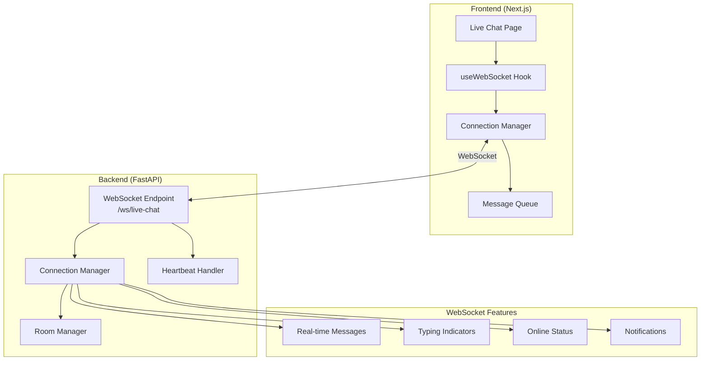
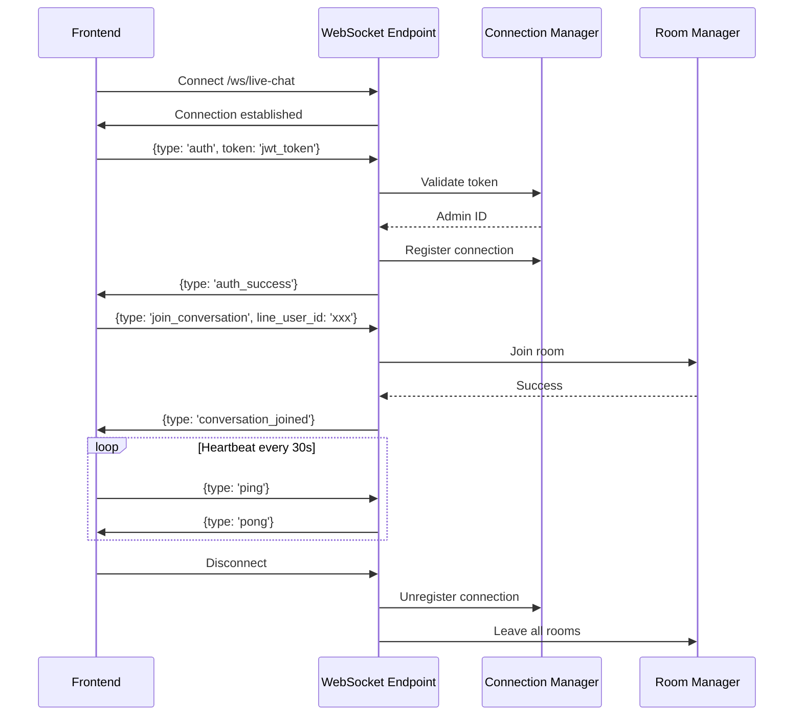
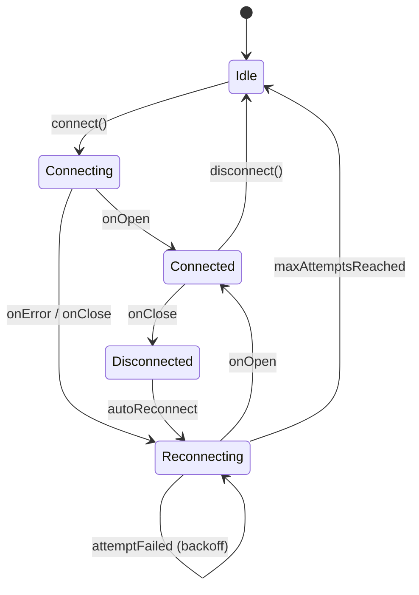

# WebSocket Architecture Plan for Live Chat

## Overview

แผนการ implement WebSocket สำหรับ Live Chat feature แทนการใช้ HTTP polling ทุก 3-5 วินาที

## Goals

1. **Real-time messaging** - ลบ polling interval ออก
2. **Typing indicators** - แสดงสถานะกำลังพิมพ์แบบ real-time
3. **Online/offline status** - ติดตามสถานะการเชื่อมต่อของ operators
4. **Notifications** - แจ้งเตือน real-time สำหรับ events ต่างๆ

## Technology Stack

### Backend (FastAPI)
- **FastAPI Native WebSocket** - ใช้ `fastapi.WebSocket` และ `fastapi.WebSocketDisconnect`
- **ไม่ใช้ socket.io** - เพื่อลด dependencies และความซับซ้อน

### Frontend (Next.js)
- **Native WebSocket API** - `new WebSocket(url)`
- **React Custom Hook** - `useWebSocket` สำหรับจัดการ connection

## Architecture Diagram



## WebSocket Message Protocol

```typescript
// Base message structure
interface WebSocketMessage {
  type: MessageType;
  payload: unknown;
  timestamp: string;
}

enum MessageType {
  // Client -> Server
  AUTH = 'auth',
  JOIN_CONVERSATION = 'join_conversation',
  LEAVE_CONVERSATION = 'leave_conversation',
  TYPING_START = 'typing_start',
  TYPING_STOP = 'typing_stop',
  MESSAGE_SEND = 'message_send',
  PING = 'ping',
  
  // Server -> Client
  AUTH_SUCCESS = 'auth_success',
  AUTH_ERROR = 'auth_error',
  MESSAGE_RECEIVED = 'message_received',
  MESSAGE_SENT = 'message_sent',
  USER_TYPING = 'user_typing',
  CONVERSATION_UPDATED = 'conversation_updated',
  OPERATOR_STATUS = 'operator_status',
  NOTIFICATION = 'notification',
  PONG = 'pong',
  ERROR = 'error'
}
```

## Connection Flow



## Room/Channel Structure

```
rooms/
├── admin:{admin_id}           # Private room สำหรับแต่ละ admin
├── conversation:{line_user_id} # Room สำหรับแต่ละ conversation
└── broadcast                  # Room สำหรับ broadcast ทั้งหมด
```

## Backend Components

### 1. WebSocket Endpoint (`/ws/live-chat`)

```python
@app.websocket("/ws/live-chat")
async def websocket_endpoint(websocket: WebSocket):
    await manager.connect(websocket)
    try:
        while True:
            data = await websocket.receive_json()
            await handle_message(websocket, data)
    except WebSocketDisconnect:
        await manager.disconnect(websocket)
```

### 2. Connection Manager

```python
class ConnectionManager:
    def __init__(self):
        self.connections: Dict[str, WebSocket] = {}  # admin_id -> websocket
        self.rooms: Dict[str, Set[str]] = {}  # room_id -> set of admin_ids
    
    async def connect(self, websocket: WebSocket) -> str:
        await websocket.accept()
        # Return connection ID
    
    async def disconnect(self, websocket: WebSocket):
        # Cleanup connections and rooms
    
    async def broadcast_to_room(self, room_id: str, message: dict):
        # Send to all in room
    
    async def send_to_admin(self, admin_id: str, message: dict):
        # Send to specific admin
```

### 3. Message Handlers

```python
async def handle_message(websocket: WebSocket, data: dict):
    handlers = {
        'auth': handle_auth,
        'join_conversation': handle_join_conversation,
        'typing_start': handle_typing_start,
        'message_send': handle_message_send,
        'ping': handle_ping,
    }
    handler = handlers.get(data['type'])
    if handler:
        await handler(websocket, data['payload'])
```

## Frontend Components

### 1. useWebSocket Hook

```typescript
interface UseWebSocketOptions {
  url: string;
  onMessage: (message: WebSocketMessage) => void;
  onConnect?: () => void;
  onDisconnect?: () => void;
  reconnectInterval?: number;
  maxReconnectAttempts?: number;
}

interface UseWebSocketReturn {
  sendMessage: (type: string, payload: unknown) => void;
  joinConversation: (lineUserId: string) => void;
  leaveConversation: (lineUserId: string) => void;
  startTyping: (lineUserId: string) => void;
  stopTyping: (lineUserId: string) => void;
  connectionState: 'connecting' | 'connected' | 'disconnected';
  isReconnecting: boolean;
}
```

### 2. Connection State Machine



### 3. Reconnection Strategy

```typescript
// Exponential backoff
const getReconnectDelay = (attempt: number): number => {
  const baseDelay = 1000; // 1 second
  const maxDelay = 30000; // 30 seconds
  const delay = Math.min(baseDelay * Math.pow(2, attempt), maxDelay);
  return delay + Math.random() * 1000; // Add jitter
};
```

## File Structure

```
backend/
└── app/
    ├── api/
    │   └── v1/
    │       └── endpoints/
    │           └── websocket.py          # WebSocket endpoint
    ├── core/
    │   └── websocket_manager.py          # Connection & room management
    └── services/
        └── websocket_service.py          # Business logic

frontend/
├── hooks/
│   └── useWebSocket.ts                   # WebSocket hook
├── lib/
│   └── websocket/
│       ├── client.ts                     # WebSocket client class
│       ├── messageQueue.ts               # Offline message queue
│       └── reconnectStrategy.ts          # Reconnection logic
└── app/
    └── admin/
        └── live-chat/
            └── page.tsx                  # Updated with WebSocket
```

## Security Considerations

1. **Authentication**: ส่ง JWT token ผ่าน query parameter หรือ first message
2. **Authorization**: Validate admin permissions ก่อน join conversation
3. **Rate Limiting**: Limit messages per second per connection
4. **Input Validation**: Validate ทุก message ด้วย Pydantic schemas

## Implementation Phases

### Phase 1: Core WebSocket (MVP)
- [ ] WebSocket endpoint
- [ ] Connection manager
- [ ] Basic authentication
- [ ] Message broadcasting

### Phase 2: Reliability
- [ ] Heartbeat/ping-pong
- [ ] Auto-reconnect
- [ ] Message queue

### Phase 3: Features
- [ ] Typing indicators
- [ ] Online status
- [ ] Notifications

## Dependencies

### Backend
```txt
# requirements.txt (no changes needed)
# FastAPI already includes WebSocket support via starlette
```

### Frontend
```json
// package.json (no additional dependencies needed)
// Using native WebSocket API
```
