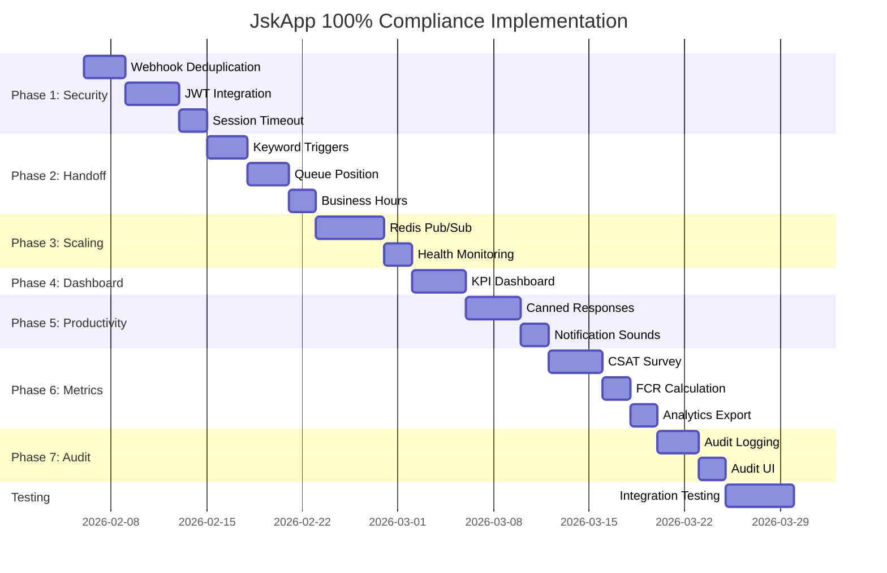

# JskApp Live Chat - 100% Compliance Implementation Plan

> **Target:** Elevate overall compliance score from **69% to 100%**  
> **Based on:** JskApp_LiveChat_Compliance_Analysis.md  
> **Research Sources:** LINE OA Best Practices, Webhook Idempotency Patterns, Redis Pub/Sub Scaling, CSAT Implementation, Canned Responses

---

## Executive Summary

| Category | Current | Target | Gap | Priority |
|----------|---------|--------|-----|----------|
| Messaging API | 85% | 100% | +15% | High |
| Live Chat Architecture | 80% | 100% | +20% | High |
| Bot-to-Human Handoff | 70% | 100% | +30% | High |
| WebSocket Real-Time | 85% | 100% | +15% | Medium |
| Admin Dashboard | 65% | 100% | +35% | Medium |
| Operator Console UX | 70% | 100% | +30% | Medium |
| Security & Access | 60% | 100% | +40% | High |
| Performance Metrics | 40% | 100% | +60% | High |
| **Overall** | **69%** | **100%** | **+31%** | **Critical** |

---

## Phase 1: Critical Security & Core Infrastructure (Week 1-2)

### Task 1.1: Webhook Duplicate Event Detection
**Goal:** Achieve 100% Messaging API compliance  
**Current Score:** 85% - Missing `webhookEventId` tracking

**Implementation:**
```python
# backend/app/services/webhook_service.py
async def process_webhook_events(events, redis):
    for event in events:
        event_id = getattr(event, 'webhook_event_id', None)
        if event_id:
            # Check Redis for duplicate (5 min TTL)
            if await redis.exists(f"webhook:event:{event_id}"):
                logger.info(f"Duplicate event {event_id}, skipping")
                continue
            await redis.setex(f"webhook:event:{event_id}", 300, "1")
        
        # Process event...
```

**Acceptance Criteria:**
- [ ] Redis deduplication key exists for each event
- [ ] Duplicate events logged and skipped
- [ ] 5-minute TTL prevents unbounded growth
- [ ] Unit tests verify deduplication logic

**Files to Modify:**
- `backend/app/api/v1/endpoints/webhook.py`
- `backend/app/services/webhook_service.py` (create)
- `backend/tests/test_webhook_deduplication.py` (create)

---

### Task 1.2: Complete JWT Authentication Integration
**Goal:** Achieve 100% Security & Access compliance  
**Current Score:** 60% - Frontend uses hardcoded admin_id

**Implementation:**
```typescript
// Frontend: WebSocket auth with JWT
const { user, token } = useAuth();

ws.send(JSON.stringify({
    type: 'auth',
    payload: { 
        token: token,  // JWT instead of admin_id
        admin_id: user?.id 
    }
}));
```

```python
# Backend: Verify JWT in WebSocket
async def handle_auth(websocket, payload):
    token = payload.get('token')
    try:
        payload = jwt.decode(token, SECRET_KEY, algorithms=['HS256'])
        admin_id = payload.get('sub')
        # Validate admin exists...
    except JWTError:
        await send_error(websocket, "Invalid token")
```

**Acceptance Criteria:**
- [ ] Frontend uses JWT from auth context
- [ ] Backend validates JWT on WebSocket connect
- [ ] Token refresh mechanism implemented
- [ ] Role-based access enforced in UI
- [ ] Audit logging for admin actions

**Files to Modify:**
- `frontend/hooks/useLiveChatSocket.ts`
- `backend/app/api/v1/endpoints/ws_live_chat.py`
- `backend/app/core/security.py` (enhance)
- `frontend/contexts/AuthContext.tsx` (enhance)

---

### Task 1.3: Session Timeout & Auto-Logout
**Goal:** Security hardening  
**Current:** Missing session timeout

**Implementation:**
```typescript
// Frontend: Auto-logout on inactivity
const INACTIVITY_TIMEOUT = 30 * 60 * 1000; // 30 minutes

useEffect(() => {
    let timeout: NodeJS.Timeout;
    const resetTimer = () => {
        clearTimeout(timeout);
        timeout = setTimeout(logout, INACTIVITY_TIMEOUT);
    };
    
    window.addEventListener('mousemove', resetTimer);
    window.addEventListener('keypress', resetTimer);
    resetTimer();
    
    return () => clearTimeout(timeout);
}, []);
```

**Acceptance Criteria:**
- [ ] 30-minute inactivity timeout
- [ ] Warning before logout (2 min)
- [ ] Graceful WebSocket disconnection
- [ ] Session cleanup on server

---

## Phase 2: Bot-to-Human Handoff Enhancement (Week 2-3)

### Task 2.1: Keyword-Based Handoff Triggers
**Goal:** Achieve 100% Bot-to-Human Handoff compliance  
**Current Score:** 70% - No keyword detection

**Implementation:**
```python
# backend/app/services/handoff_service.py
HANDOFF_KEYWORDS = [
    # English
    "agent", "human", "operator", "representative",
    "support", "help desk", "live person",
    # Thai
    "พูดกับเจ้าหน้าที่", "ติดต่อเจ้าหน้าที่", "คุยกับคน",
    "ขอคน", "ต้องการคน", "เจ้าหน้าที่"
]

async def check_handoff_keywords(text: str, user, reply_token, db):
    text_lower = text.strip().lower()
    if any(kw in text_lower for kw in HANDOFF_KEYWORDS):
        if user.chat_mode == ChatMode.BOT:
            await live_chat_service.initiate_handoff(user, reply_token, db)
            return True
    return False
```

**Integration Point:**
```python
# backend/app/api/v1/endpoints/webhook.py
async def handle_message_event(event, db):
    text = event.message.text
    user = await friend_service.get_or_create_user(line_user_id, db)
    
    # Check handoff keywords first
    if await handoff_service.check_handoff_keywords(text, user, event.reply_token, db):
        return
    
    # Continue with normal bot flow...
```

**Acceptance Criteria:**
- [ ] Keyword detection in Thai and English
- [ ] Automatic handoff initiation
- [ ] Graceful transition message
- [ ] Keyword list configurable via admin
- [ ] Analytics on keyword-triggered handoffs

---

### Task 2.2: Queue Position & Wait Time Display
**Goal:** Enhance handoff transparency  
**Current:** No queue information

**Implementation:**
```python
# backend/app/services/live_chat_service.py
async def get_queue_position(line_user_id: str, db) -> dict:
    """Get user's position in WAITING queue"""
    result = await db.execute(
        select(ChatSession)
        .where(ChatSession.status == SessionStatus.WAITING)
        .order_by(ChatSession.created_at)
    )
    waiting_sessions = result.scalars().all()
    
    position = next(
        (i + 1 for i, s in enumerate(waiting_sessions) if s.line_user_id == line_user_id),
        0
    )
    
    avg_wait_time = await calculate_avg_wait_time(db)
    estimated_wait = position * avg_wait_time
    
    return {
        "position": position,
        "total_waiting": len(waiting_sessions),
        "estimated_wait_minutes": estimated_wait
    }
```

**LINE Flex Message:**
```python
# Send queue status to user
flex_message = FlexMessage(
    alt_text="Queue Status",
    contents={
        "type": "bubble",
        "body": {
            "type": "box",
            "layout": "vertical",
            "contents": [
                {"type": "text", "text": "🕐 กำลังรอเจ้าหน้าที่", "weight": "bold"},
                {"type": "text", "text": f"ตำแหน่งคิว: {position}/{total}"},
                {"type": "text", "text": f"เวลารอโดยประมาณ: {wait_time} นาที"}
            ]
        }
    }
)
```

**Acceptance Criteria:**
- [ ] Queue position calculated correctly
- [ ] Estimated wait time based on historical data
- [ ] Real-time updates via push message
- [ ] Thai language support
- [ ] Admin dashboard shows queue metrics

---

### Task 2.3: Business Hours Handling
**Goal:** Professional after-hours experience  
**Current:** Missing

**Implementation:**
```python
# backend/app/core/business_hours.py
from datetime import datetime, time
import pytz

BANGKOK_TZ = pytz.timezone('Asia/Bangkok')

BUSINESS_HOURS = {
    "monday": (time(8, 0), time(17, 0)),
    "tuesday": (time(8, 0), time(17, 0)),
    # ... etc
}

def is_business_hours() -> bool:
    now = datetime.now(BANGKOK_TZ)
    day = now.strftime("%A").lower()
    
    if day not in BUSINESS_HOURS:
        return False
    
    start, end = BUSINESS_HOURS[day]
    return start <= now.time() <= end
```

**Handoff with Business Hours:**
```python
async def initiate_handoff(user, reply_token, db):
    if not is_business_hours():
        # Send after-hours message
        await line_service.reply_text(
            reply_token,
            "ขออภัย ขณะนี้อยู่นอกเวลาทำการ (จันทร์-ศุกร์ 08:00-17:00)\n"
            "กรุณาฝากข้อความไว้ เจ้าหน้าที่จะติดต่อกลับในวันถัดไป"
        )
        # Create ticket for follow-up
        await create_offline_ticket(user, db)
        return
    
    # Normal handoff flow...
```

**Acceptance Criteria:**
- [ ] Configurable business hours
- [ ] After-hours message in Thai
- [ ] Offline ticket creation
- [ ] Holiday support
- [ ] Admin can toggle override

---

## Phase 3: Real-Time Infrastructure Scaling (Week 3-4)

### Task 3.1: Redis Pub/Sub for Horizontal Scaling
**Goal:** Achieve 100% WebSocket scalability  
**Current Score:** 85% - In-memory only (single server)

**Implementation:**
```python
# backend/app/core/websocket_manager.py
import aioredis
import json

class ScalableConnectionManager(ConnectionManager):
    def __init__(self):
        super().__init__()
        self.redis = None
        self.pubsub = None
        
    async def initialize(self):
        self.redis = await aioredis.from_url(
            settings.REDIS_URL,
            encoding='utf-8',
            decode_responses=True
        )
        self.pubsub = self.redis.pubsub()
        
        # Subscribe to broadcast channel
        await self.pubsub.subscribe("live_chat:broadcast")
        asyncio.create_task(self._listen_redis())
    
    async def _listen_redis(self):
        """Listen for messages from other servers"""
        async for message in self.pubsub.listen():
            if message['type'] == 'message':
                data = json.loads(message['data'])
                # Broadcast to local connections
                await self._broadcast_local(data)
    
    async def broadcast_to_all(self, data: dict):
        # Publish to Redis (reaches all servers)
        await self.redis.publish("live_chat:broadcast", json.dumps(data))
        # Also broadcast locally
        await self._broadcast_local(data)
    
    async def broadcast_to_room(self, room_id: str, data: dict):
        channel = f"live_chat:room:{room_id}"
        await self.redis.publish(channel, json.dumps(data))
        await self._broadcast_room_local(room_id, data)
```

**Acceptance Criteria:**
- [ ] Redis Pub/Sub integration
- [ ] Cross-server message broadcasting
- [ ] Room-based channel isolation
- [ ] Graceful fallback to local-only
- [ ] Health check for Redis connection

**Files to Modify:**
- `backend/app/core/websocket_manager.py`
- `backend/app/core/config.py` (Redis config)
- `docker-compose.yml` (Redis service)

---

### Task 3.2: Connection Health Monitoring
**Goal:** Production-ready WebSocket reliability

**Implementation:**
```python
# backend/app/core/websocket_health.py
class WebSocketHealthMonitor:
    def __init__(self):
        self.metrics = {
            "total_connections": 0,
            "messages_per_second": 0,
            "error_rate": 0,
            "avg_latency_ms": 0
        }
    
    async def record_connection(self):
        self.metrics["total_connections"] += 1
    
    async def record_message(self, latency_ms: float):
        # Exponential moving average
        self.metrics["avg_latency_ms"] = (
            0.9 * self.metrics["avg_latency_ms"] + 0.1 * latency_ms
        )
    
    async def get_health_status(self) -> dict:
        return {
            "status": "healthy" if self.metrics["error_rate"] < 0.01 else "degraded",
            "metrics": self.metrics,
            "redis_connected": await self.check_redis()
        }
```

---

## Phase 4: Admin Dashboard & KPI Enhancement (Week 4-5)

### Task 4.1: Real-Time KPI Dashboard
**Goal:** Achieve 100% Admin Dashboard compliance  
**Current Score:** 65% - Only basic counts

**Implementation:**
```typescript
// frontend/app/admin/dashboard/KpiCards.tsx
interface KpiData {
  waiting: number;
  active: number;
  avgFirstResponseTime: number;  // seconds
  avgResolutionTime: number;     // seconds
  csatScore: number;             // percentage
  fcrRate: number;               // First Contact Resolution
}

export function KpiDashboard() {
  const [kpis, setKpis] = useState<KpiData>();
  
  // Real-time updates via WebSocket
  useEffect(() => {
    const ws = new WebSocket(WS_URL);
    ws.onmessage = (event) => {
      const data = JSON.parse(event.data);
      if (data.type === 'kpi_update') {
        setKpis(data.payload);
      }
    };
  }, []);
  
  return (
    <div className="grid grid-cols-5 gap-4">
      <KpiCard 
        title="Waiting" 
        value={kpis?.waiting} 
        icon={<UsersIcon />}
        trend={calculateTrend(kpis?.waiting)}
      />
      <KpiCard 
        title="Active" 
        value={kpis?.active} 
        icon={<ChatIcon />}
      />
      <KpiCard 
        title="Avg FRT" 
        value={`${kpis?.avgFirstResponseTime}s`}
        subtitle="First Response Time"
        target="< 60s"
      />
      <KpiCard 
        title="CSAT" 
        value={`${kpis?.csatScore}%`}
        trend={{ direction: 'up', value: 5 }}
        target="> 90%"
      />
      <KpiCard 
        title="FCR Rate" 
        value={`${kpis?.fcrRate}%`}
        subtitle="First Contact Resolution"
        target="> 70%"
      />
    </div>
  );
}
```

**Backend Aggregation:**
```python
# backend/app/services/analytics_service.py
async def calculate_realtime_kpis(db) -> dict:
    # Waiting/Active counts
    waiting = await db.scalar(
        select(func.count()).where(ChatSession.status == SessionStatus.WAITING)
    )
    active = await db.scalar(
        select(func.count()).where(ChatSession.status == SessionStatus.ACTIVE)
    )
    
    # Average First Response Time (last hour)
    avg_frt = await db.scalar(
        select(func.avg(
            ChatSession.first_response_at - ChatSession.claimed_at
        ))
        .where(ChatSession.first_response_at.isnot(None))
        .where(ChatSession.claimed_at > datetime.utcnow() - timedelta(hours=1))
    )
    
    # CSAT from last 24 hours
    csat = await db.scalar(
        select(func.avg(CsatResponse.score))
        .where(CsatResponse.created_at > datetime.utcnow() - timedelta(days=1))
    )
    
    return {
        "waiting": waiting,
        "active": active,
        "avgFirstResponseTime": avg_frt.total_seconds() if avg_frt else 0,
        "csatScore": round(csat * 20, 1) if csat else 0  # Convert 1-5 to %
    }
```

**Acceptance Criteria:**
- [ ] 5 KPI cards displayed
- [ ] Real-time updates via WebSocket
- [ ] Trend indicators (up/down arrows)
- [ ] Target comparison (green/yellow/red)
- [ ] Historical charts (7-day trend)

---

## Phase 5: Operator Productivity Features (Week 5-6)

### Task 5.1: Canned Responses / Quick Replies
**Goal:** Achieve 100% Operator Console UX compliance  
**Current Score:** 70% - No template feature

**Implementation:**
```typescript
// frontend/components/admin/CannedResponses.tsx
interface CannedResponse {
  id: string;
  shortcut: string;      // "/greeting"
  title: string;         // "Greeting"
  content: string;       // "สวัสดีค่ะ ยินดีให้บริการค่ะ"
  category: string;      // "greeting", "closing", "escalation"
}

const DEFAULT_TEMPLATES: CannedResponse[] = [
  {
    id: "1",
    shortcut: "/greeting",
    title: "ทักทาย",
    content: "สวัสดีค่ะ/ครับ ยินดีให้บริการค่ะ/ครับ มีอะไรให้ช่วยเหลือคะ?",
    category: "greeting"
  },
  {
    id: "2", 
    shortcut: "/closing",
    title: "ปิดการสนทนา",
    content: "ขอบคุณที่ใช้บริการค่ะ/ครับ หากมีข้อสงสัยเพิ่มเติมสามารถติดต่อได้ตลอดเวลาค่ะ/ครับ",
    category: "closing"
  },
  {
    id: "3",
    shortcut: "/transfer",
    title: "ส่งต่อเจ้าหน้าที่",
    content: "กรุณารอสักครู่นะคะ/ครับ จะติดต่อเจ้าหน้าที่ที่เกี่ยวข้องมาช่วยเหลือค่ะ/ครับ",
    category: "escalation"
  }
];

export function CannedResponsePicker({ onSelect }: { onSelect: (text: string) => void }) {
  const [search, setSearch] = useState("");
  const [templates, setTemplates] = useLocalStorage("canned_responses", DEFAULT_TEMPLATES);
  
  return (
    <Popover>
      <PopoverTrigger asChild>
        <Button variant="outline" size="sm">
          <TemplateIcon className="w-4 h-4 mr-2" />
          Quick Reply
        </Button>
      </PopoverTrigger>
      <PopoverContent className="w-80">
        <Command>
          <CommandInput 
            placeholder="Search templates..." 
            value={search}
            onValueChange={setSearch}
          />
          <CommandList>
            {templates
              .filter(t => t.shortcut.includes(search) || t.title.includes(search))
              .map(template => (
                <CommandItem 
                  key={template.id}
                  onSelect={() => onSelect(template.content)}
                >
                  <span className="text-muted-foreground mr-2">{template.shortcut}</span>
                  <span>{template.title}</span>
                </CommandItem>
              ))}
          </CommandList>
        </Command>
      </PopoverContent>
    </Popover>
  );
}
```

**Chat Input Integration:**
```typescript
// frontend/app/admin/live-chat/ChatInput.tsx
export function ChatInput() {
  const [text, setText] = useState("");
  const inputRef = useRef<HTMLInputElement>(null);
  
  // Handle shortcut detection
  const handleChange = (e: React.ChangeEvent<HTMLInputElement>) => {
    const value = e.target.value;
    
    // Auto-expand shortcuts
    if (value.startsWith("/")) {
      const shortcut = value.split(" ")[0];
      const template = findTemplate(shortcut);
      if (template && value.includes(" ")) {
        setText(template.content);
        return;
      }
    }
    
    setText(value);
  };
  
  return (
    <div className="flex items-center gap-2 p-4 border-t">
      <CannedResponsePicker onSelect={setText} />
      <Input
        ref={inputRef}
        value={text}
        onChange={handleChange}
        placeholder="Type / for quick replies..."
        onKeyDown={(e) => e.key === "Enter" && sendMessage()}
      />
      <Button onClick={sendMessage}>
        <SendIcon className="w-4 h-4" />
      </Button>
    </div>
  );
}
```

**Acceptance Criteria:**
- [ ] 10+ default templates in Thai
- [ ] Shortcut system (/greeting, /closing)
- [ ] Searchable template picker
- [ ] Custom template creation
- [ ] Category organization
- [ ] Personalization variables {{customer_name}}

---

### Task 5.2: Notification Sounds
**Goal:** Alert operators to new messages

**Implementation:**
```typescript
// frontend/hooks/useNotificationSound.ts
const SOUNDS = {
  new_message: "/sounds/message-pop.mp3",
  new_session: "/sounds/bell-notification.mp3",
  handoff_request: "/sounds/urgent-chime.mp3"
};

export function useNotificationSound() {
  const [enabled, setEnabled] = useLocalStorage("sound_enabled", true);
  const audioRef = useRef<HTMLAudioElement>(null);
  
  const play = useCallback((type: keyof typeof SOUNDS) => {
    if (!enabled) return;
    
    const audio = new Audio(SOUNDS[type]);
    audio.volume = 0.5;
    audio.play().catch(() => {
      // Browser may block autoplay
    });
  }, [enabled]);
  
  return { play, enabled, setEnabled };
}

// Usage in live chat
function LiveChatPage() {
  const { play } = useNotificationSound();
  
  useEffect(() => {
    ws.onmessage = (event) => {
      const data = JSON.parse(event.data);
      
      if (data.type === "new_message" && !document.hasFocus()) {
        play("new_message");
        // Also show browser notification
        new Notification("New Message", { body: data.payload.text });
      }
    };
  }, []);
}
```

**Acceptance Criteria:**
- [ ] Sound toggle in settings
- [ ] Different sounds for different events
- [ ] Browser notification permission
- [ ] Sound only when window not focused
- [ ] Volume control

---

## Phase 6: Performance Metrics & CSAT (Week 6-7)

### Task 6.1: CSAT Survey Collection
**Goal:** Achieve 100% Performance Metrics compliance  
**Current Score:** 40% - No post-chat survey

**Implementation:**
```python
# backend/app/services/csat_service.py
async def send_csat_survey(line_user_id: str, session_id: str, db):
    """Send CSAT survey after session closes"""
    
    flex_message = FlexMessage(
        alt_text="ขอบคุณที่ใช้บริการ - กรุณาให้คะแนนความพึงพอใจ",
        contents={
            "type": "bubble",
            "body": {
                "type": "box",
                "layout": "vertical",
                "contents": [
                    {
                        "type": "text",
                        "text": "ขอบคุณที่ใช้บริการค่ะ/ครับ 🙏",
                        "weight": "bold",
                        "size": "lg"
                    },
                    {
                        "type": "text",
                        "text": "กรุณาให้คะแนนความพึงพอใจในการบริการ",
                        "margin": "md"
                    }
                ]
            },
            "footer": {
                "type": "box",
                "layout": "horizontal",
                "spacing": "md",
                "contents": [
                    {
                        "type": "button",
                        "style": "primary",
                        "action": {
                            "type": "postback",
                            "label": "⭐",
                            "data": f"csat|{session_id}|1"
                        }
                    },
                    # ... buttons for 2-5 stars
                ]
            }
        }
    )
    
    await line_service.push_messages(line_user_id, [flex_message])
```

**CSAT Response Handler:**
```python
# backend/app/models/csat_response.py
class CsatResponse(Base):
    __tablename__ = "csat_responses"
    
    id = Column(Integer, primary_key=True)
    session_id = Column(Integer, ForeignKey("chat_sessions.id"))
    score = Column(Integer)  # 1-5
    comment = Column(Text, nullable=True)
    created_at = Column(DateTime, default=datetime.utcnow)
    
    # Relationship
    session = relationship("ChatSession", back_populates="csat_response")

# Handle postback
async def handle_csat_postback(event, data, db):
    _, session_id, score = data.split("|")
    
    csat = CsatResponse(
        session_id=int(session_id),
        score=int(score)
    )
    db.add(csat)
    await db.commit()
    
    # Thank user
    await line_service.reply_text(
        event.reply_token,
        "ขอบคุณสำหรับคะแนนค่ะ/ครับ เราจะนำไปปรับปรุงการบริการ 🙏"
    )
```

**Analytics Integration:**
```python
# backend/app/services/analytics_service.py
async def get_csat_metrics(db, days: int = 30) -> dict:
    result = await db.execute(
        select(
            func.avg(CsatResponse.score).label("avg_score"),
            func.count().label("total"),
            func.sum(case((CsatResponse.score >= 4, 1), else_=0)).label("positive")
        )
        .where(CsatResponse.created_at > datetime.utcnow() - timedelta(days=days))
    )
    row = result.one()
    
    return {
        "average_score": round(row.avg_score, 2) if row.avg_score else 0,
        "response_count": row.total,
        "csat_percentage": round((row.positive / row.total) * 100, 1) if row.total else 0,
        "nps": calculate_nps(row.avg_score)
    }
```

**Acceptance Criteria:**
- [ ] CSAT survey sent after session close
- [ ] 5-star rating UI in LINE
- [ ] Optional comment collection
- [ ] Response stored in database
- [ ] Admin dashboard shows CSAT trends
- [ ] NPS calculation

---

### Task 6.2: FCR (First Contact Resolution) Calculation
**Goal:** Track resolution effectiveness

**Implementation:**
```python
# backend/app/services/analytics_service.py
async def calculate_fcr_rate(db, days: int = 30) -> float:
    """
    FCR = Sessions resolved in first contact / Total sessions
    A session is "first contact resolved" if:
    - No reopening within 24 hours
    - CSAT score >= 4
    - Not escalated to another department
    """
    
    # Get closed sessions in period
    result = await db.execute(
        select(ChatSession)
        .where(ChatSession.status == SessionStatus.CLOSED)
        .where(ChatSession.closed_at > datetime.utcnow() - timedelta(days=days))
    )
    sessions = result.scalars().all()
    
    fcr_count = 0
    for session in sessions:
        # Check if reopened within 24 hours
        reopened = await db.scalar(
            select(func.count())
            .where(ChatSession.line_user_id == session.line_user_id)
            .where(ChatSession.created_at > session.closed_at)
            .where(ChatSession.created_at < session.closed_at + timedelta(hours=24))
        )
        
        # Check CSAT
        csat = await db.scalar(
            select(CsatResponse.score)
            .where(CsatResponse.session_id == session.id)
        )
        
        if not reopened and csat and csat >= 4:
            fcr_count += 1
    
    return (fcr_count / len(sessions)) * 100 if sessions else 0
```

---

### Task 6.3: Analytics Export
**Goal:** Reporting capabilities

**Implementation:**
```python
# backend/app/api/v1/endpoints/analytics.py
@router.get("/export")
async def export_analytics(
    start_date: date,
    end_date: date,
    format: str = "csv",  # csv, xlsx
    db: AsyncSession = Depends(get_db),
    current_user: User = Depends(get_current_admin)
):
    """Export analytics data"""
    
    # Generate report data
    data = await analytics_service.generate_report(start_date, end_date, db)
    
    if format == "csv":
        output = io.StringIO()
        writer = csv.DictWriter(output, fieldnames=data[0].keys())
        writer.writeheader()
        writer.writerows(data)
        
        return StreamingResponse(
            io.BytesIO(output.getvalue().encode()),
            media_type="text/csv",
            headers={"Content-Disposition": f"attachment; filename=analytics_{start_date}.csv"}
        )
```

---

## Phase 7: Audit & Logging (Week 7-8)

### Task 7.1: Admin Action Audit Logging
**Goal:** Complete Security & Access compliance

**Implementation:**
```python
# backend/app/models/audit_log.py
class AuditLog(Base):
    __tablename__ = "audit_logs"
    
    id = Column(Integer, primary_key=True)
    admin_id = Column(Integer, ForeignKey("users.id"))
    action = Column(String)  # "claim_session", "close_session", "send_message"
    resource_type = Column(String)  # "chat_session", "user"
    resource_id = Column(String)
    details = Column(JSONB)  # Additional context
    ip_address = Column(String)
    user_agent = Column(String)
    created_at = Column(DateTime, default=datetime.utcnow)

# Decorator for audit logging
def audit_log(action: str, resource_type: str):
    def decorator(func):
        @wraps(func)
        async def wrapper(*args, **kwargs):
            db = kwargs.get('db')
            admin_id = kwargs.get('admin_id')
            
            # Execute action
            result = await func(*args, **kwargs)
            
            # Log the action
            log = AuditLog(
                admin_id=admin_id,
                action=action,
                resource_type=resource_type,
                resource_id=str(result.id) if result else None,
                details={"params": str(kwargs)}
            )
            db.add(log)
            await db.commit()
            
            return result
        return wrapper
    return decorator

# Usage
class LiveChatService:
    @audit_log("claim_session", "chat_session")
    async def claim_session(self, line_user_id: str, admin_id: int, db):
        # ... existing code
```

**Admin Audit View:**
```typescript
// frontend/app/admin/audit/page.tsx
export default function AuditLogPage() {
  const [logs, setLogs] = useState<AuditLog[]>();
  
  return (
    <DataTable
      columns={[
        { accessorKey: "created_at", header: "Time" },
        { accessorKey: "admin.username", header: "Admin" },
        { accessorKey: "action", header: "Action" },
        { accessorKey: "resource_type", header: "Resource" },
        { accessorKey: "ip_address", header: "IP" }
      ]}
      data={logs}
      filterable
      exportable
    />
  );
}
```

**Acceptance Criteria:**
- [ ] All admin actions logged
- [ ] IP address and user agent captured
- [ ] Searchable audit log UI
- [ ] Export to CSV
- [ ] Retention policy (90 days)

---

## Implementation Timeline



---

## Success Metrics

| Metric | Current | Target | Measurement |
|--------|---------|--------|-------------|
| Overall Compliance | 69% | 100% | Automated checklist |
| Messaging API | 85% | 100% | Webhook dedup + signature |
| Security & Access | 60% | 100% | JWT + audit + timeout |
| Bot-to-Human | 70% | 100% | Keywords + queue + hours |
| Performance Metrics | 40% | 100% | CSAT + FCR + export |
| Test Coverage | 44 tests | 80+ tests | pytest report |
| Avg Response Time | - | < 200ms | WebSocket benchmark |

---

## Risk Mitigation

| Risk | Impact | Mitigation |
|------|--------|------------|
| Redis dependency | High | Fallback to local-only mode |
| JWT migration | Medium | Backward compatibility with admin_id |
| Thai NLP accuracy | Medium | Extensive keyword testing |
| Browser notifications | Low | Graceful degradation |
| CSAT response rate | Low | Gentle reminder after 24h |

---

## References

1. **Webhook Best Practices:** [dev.to - Stop Doing Business Logic in Webhook Endpoints](https://dev.to/elvissautet/stop-doing-business-logic-in-webhook-endpoints)
2. **LINE Webhook Security:** [LINE Official Account Manager](https://developers.line.biz/)
3. **Redis Pub/Sub Scaling:** [ably.com - Scaling Pub/Sub with WebSockets and Redis](https://ably.com/blog/scaling-pub-sub-with-websockets-and-redis)
4. **CSAT Best Practices:** [liveagent.com - Live Chat Surveys](https://www.liveagent.com/blog/chat-surveys/)
5. **Canned Responses:** [zendesk.com - 100+ Best Canned Responses](https://www.zendesk.com/blog/live-chat-canned-responses/)
6. **Chatbot-to-Human Handoff:** [spurnow.com - Complete Guide](https://www.spurnow.com/en/blogs/chatbot-to-human-handoff)

---

*Plan generated for JskApp development team. February 2026.*
